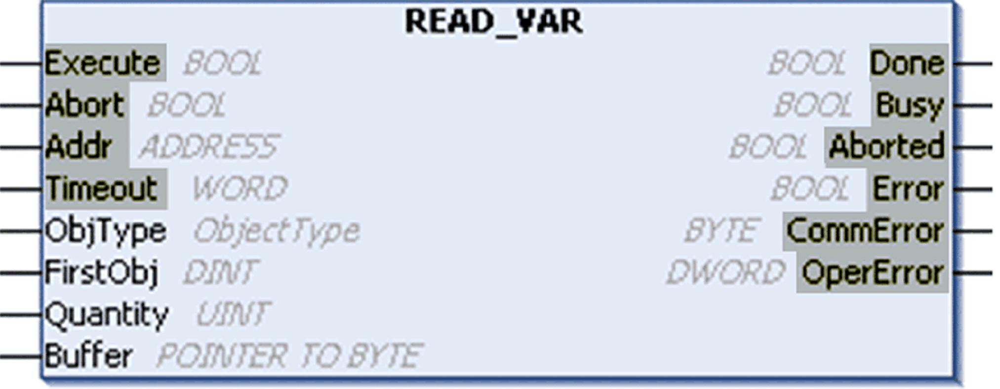
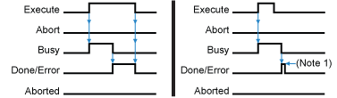
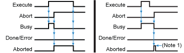

# Generic Parameters

## Introduction

This topic describes the management and operations of the controllers’ communication functions using the `READ_VAR` function block as an example. (The PLCopen standard defines rules for function blocks.)

NOTE: These parameters are common to all PLCCommunication function blocks (except ADDM).

## Graphical Representation

The parameters that are common to all function blocks in the PLCCommunication library are highlighted in this graphic:

## Common Parameters

These parameters are shared by several function blocks in the PLCCommunication library:

| Input | Type | Comment |
| --- | --- | --- |
| `Execute` | BOOL | The function is executed on the rising edge of this input.  **NOTE:** When `xExecute` is set to TRUE at the first task cycle in RUN after a cold or warm reset, the rising edge is not detected. |
| `Abort` | BOOL | Aborts the ongoing operation at the rising edge |
| `Addr` | ADDRESS | Address of the targeted external device (can be the output of the [ADDM function block](D-RU-0004973.html#D-RU-0004973)) |
| `Timeout` | WORD | Exchange timeout is a multiple of 100 ms (0 for infinite)  NOTE: The Timeout time is fixed at ≅1 s for the HMI SCU and cannot be set for the Modbus communication function blocks. |
| **NOTE:** A function block operation may require several exchanges. The timeout applies to each exchange between the controller and the modem, so the global duration of the function block might be longer than the timeout. | | |

| Output | Type | Comment |
| --- | --- | --- |
| `Done` | BOOL | `Done` is set to `TRUE` when the function is completed successfully. |
| `Busy` | BOOL | `Busy` is set to `TRUE` while the function is ongoing. |
| `Aborted` | BOOL | `Aborted` is set to `TRUE` when the function is aborted with the `Abort` input. When the function is aborted, `CommError` contains the code `Canceled - 16#02` (exchange stopped by a user request). |
| `Error` | BOOL | `Error` is set to `TRUE` when the function stops because of a detected error. When there is a detected error, `CommError` and `OperError` contain information about the detected error. |
| `CommError` | BYTE | `CommError` contains [communication error codes](D-RU-0004859.html#D-RU-0004859). |
| `OperError` | DWORD | `OperError` contains [operation error codes](D-RU-0004860.html#D-RU-0004860). |

NOTE: As soon as the `Busy` output is reset to 0, one (and only one) of these 3 outputs is set to 1:

* `Done`
* `Error`
* `Aborted`

Function blocks require a rising edge in order to be initiated. The function block needs to first see the `Execute` input as false in order to detect a subsequent rising edge.

| WARNING | |
| --- | --- |
|  | UNINTENDED EQUIPMENT OPERATION  Always make the first call to a function block with its `Execute` input set to `FALSE` so that it will detect a subsequent rising edge.  Failure to follow these instructions can result in death, serious injury, or equipment damage. |

## Function Execution

The function starts at the rising edge of the `Execute` input. The `Busy` output is then set to `TRUE`. This figure shows the function block's behavior when the operation is automatically completed (with or without detected errors):

**Note 1:** The `Done` or `Error` bit is set to `TRUE` during a task cycle only if `Execute` has already been reset to `FALSE` when the operation ended.

## Function Aborted

This figure shows the function being aborted by the application. The rising edge of the `Abort` input cancels the ongoing function. In such cases, the aborted output is set to 1 and `CommError` contains the code `Canceled - 16#02` (exchange stopped by a user request):

**Note 1:** The `Abort` bit is set to `TRUE` during a task cycle only if `Execute` has already been reset to `FALSE` when the abort request occurred.

EIO0000002962.02