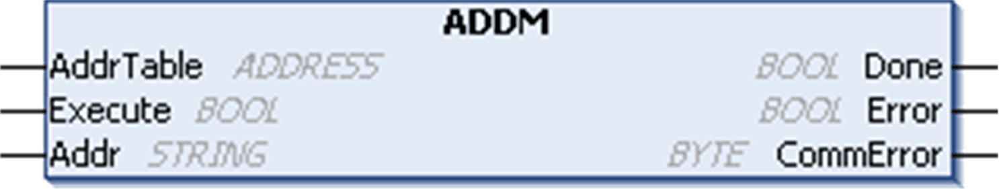
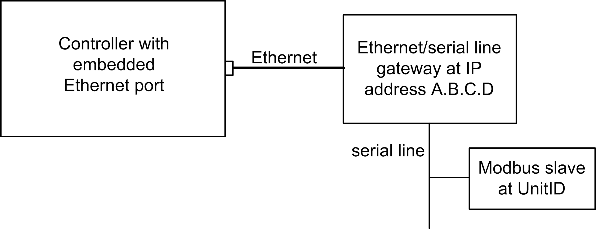
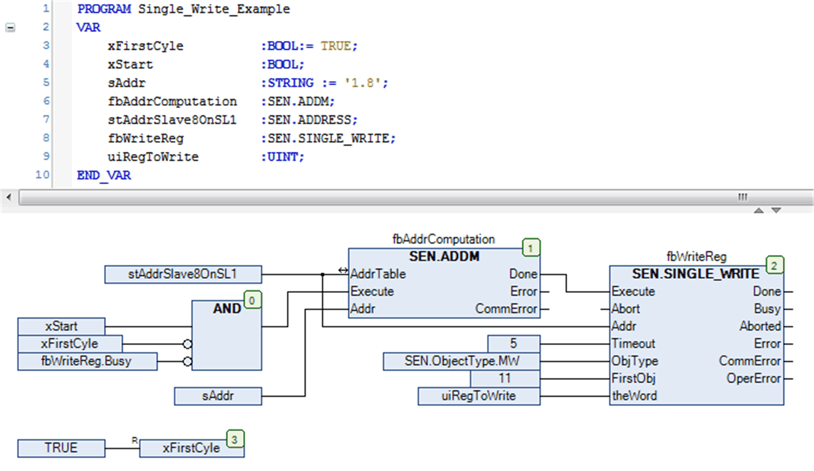

# `ADDM`: Convert a String into an Address

## Function Description

The `ADDM` function block converts a destination address that is represented as a string to an ADDRESS structure. You can use the ADDRESS structure as an entry in a communication function block.

## Graphical Representation

## `ADDM` - Specific Parameter Description

| Input/Output | Type | Comment |
| --- | --- | --- |
| `AddrTable` | ADDRESS | This is the ADDRESS structure to be filled by the function block. |

| Input | Type | Comment |
| --- | --- | --- |
| `Execute` | BOOL | Executes the function at the rising edge. |
| `Addr` | STRING | Address in STRING type to be converted in ADDRESS type (see details below). |

| Output | Type | Comment |
| --- | --- | --- |
| `Done` | BOOL | `Done` is set to `TRUE` when the function is completed successfully.  NOTE: When the operation is aborted with the Abort input, Done is not set to 1 (only `Aborted`). |
| `Error` | BOOL | `Error` is set to `TRUE` when the function stops due to detection of an error. When there is a detected error, `CommError` and `OperError` contain information about the detected error. |
| `CommError` | BYTE | `CommError` contains [communication error codes](D-RU-0004859.html#D-RU-0004859). |

NOTE: A rising edge on the `Execute` input executes the conversion and returns an immediate update of `AddrTable`. However, `AddrTable` retains the last value when an error is detected (that is when the `Addr` string is not correct).

Function blocks require a rising edge in order to be initiated. The function block needs to first see the `Execute` input as `FALSE` in order to detect a subsequent rising edge.

| WARNING | |
| --- | --- |
|  | UNINTENDED EQUIPMENT OPERATION  Always make the first call to a function block with its `Execute` input set to `FALSE` so that it may detect a subsequent rising edge.  Failure to follow these instructions can result in death, serious injury, or equipment damage. |

## Addr STRING for ASCII Address Format

For ASCII addressing, only the communication port number is requested:

`'<communication port number>'`

For example, to send a user-defined message on serial line 2, use the string `'2'`.

This table defines the fields in the ADDM output for the ASCII address format:

| Field | Type | Value | Example |
| --- | --- | --- | --- |
| `_Type` | BYTE | Reserved | Not used |
| `_CliID` | BYTE | Reserved | Not used |
| `Rack` | BYTE | Rack number (always 0) | 0 |
| `Module` | BYTE | Module number (always 0) | 0 |
| `Link` | [LinkNumber](D-RU-0004858.html#D-RU-0004858) | `<communication port number>` | 2 |
| `_ProtId` | BYTE | Not used | Not used |
| `AddrLen` | BYTE | 0 | 0 |
| `UnitId` | BYTE | Not used | Not used |
| `AddrExt` | ADDR\_EXT | Not used | Not used |

## Addr STRING for Modbus TCP Address Format

**Address of a Modbus TCP Standard Slave**

For the Modbus TCP standard slave address format, the communication port number (3 for the embedded Ethernet port) and the destination IP address are requested:

`'<communication port number>{<IP address>}'`

NOTE: A Modbus TCP standard slave uses Modbus address 255 (the `UnitId` default value). However, a Modbus TCP device may have different value (for example, a TeSys has Modbus address 1). In this case, add the `UnitId` value:

`'<communication port number>{<IP address>}<UnitId>'`

TCP port 502 is used by default. It is possible to use a non-standard port by adding the requested port number to the IP address:

`'<communication port number>{<IP address>:<port>}'`

For example, to send a message at Modbus TCP slave IP address 192.168.1.2 using standard TCP port 502, use this string: `'3{192.168.1.2}'`

The `ADDM` function fills the `AddrTable` input/output with these values:

| Field | Type | Value | Example |
| --- | --- | --- | --- |
| `_Type` | BYTE | Reserved | Not used |
| `_CliID` | BYTE | Reserved | Not used |
| `Rack` | BYTE | Rack number | 0 |
| `Module` | BYTE | Module number | 0 |
| `Link` | [LinkNumber](D-RU-0004858.html#D-RU-0004858) | `<communication port number>` | 3 |
| `_ProtId` | BYTE | 0 for Modbus | 0 |
| `AddrLen` | BYTE | `UnitID + AdrExt` length in bytes | 7 |
| `UnitId` | BYTE | Modbus address (255 by default) | 255 |
| `AddrExt` | TCP\_ADDR\_EXT | A | 192 |
| B | 168 |
| C | 1 |
| D | 2 |
| <port> (default = 502) | 502 |

**Address of a Modbus Serial Slave Through Ethernet/Serial Line Gateway**

It is also possible to address a Modbus slave through an Ethernet/serial line gateway:

The request includes the communication port number, gateway IP address with or without TCP port), and the Modbus serial slave address (UnitId parameter):

`'<communication port number>{<IP address>}<slave address>'`

For example, to send a message at Modbus Serial slave address 5 through a Ethernet/serial line gateway at IP address 192.168.1.2 using standard TCP port 502, use this string: `'3{192.168.1.2}5'`

The `ADDM` function fills the `AddrTable` input/output with these values:

| Field | Size | Value | Example |
| --- | --- | --- | --- |
| `_Type` | BYTE | Reserved | Not used |
| `_CliID` | BYTE | Reserved | Not used |
| `Rack` | BYTE | Rack number | 0 |
| `Module` | BYTE | Module number | 0 |
| `Link` | [LinkNumber](D-RU-0004858.html#D-RU-0004858) | `<communication port number>` | 3 |
| `_ProtId` | BYTE | 0 for Modbus | 0 |
| `AddrLen` | BYTE | `UnitID + AdrExt` length in bytes | 7 |
| `UnitId` | BYTE | <Slave address> | 5 |
| `AddrExt` | TCP\_ADDR\_EXT | A | 192 |
| B | 168 |
| C | 1 |
| D | 2 |
| TCP port number (default = 502) | 502 |

## Example

This example shows the implementation of the `ADDM` function block in conjunction with the `SINGLE_WRITE` function block. The `ADDM` function block converts the given STRING '1.8' to the variable `stSlave8OnSL1` of type `ADDRESS`. If the conversion was successful the input `Execute` of subsequent function block `SINGLE_WRITE` is triggered.

EIO0000002962.02