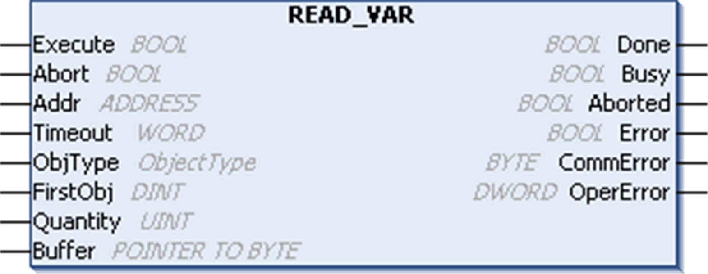
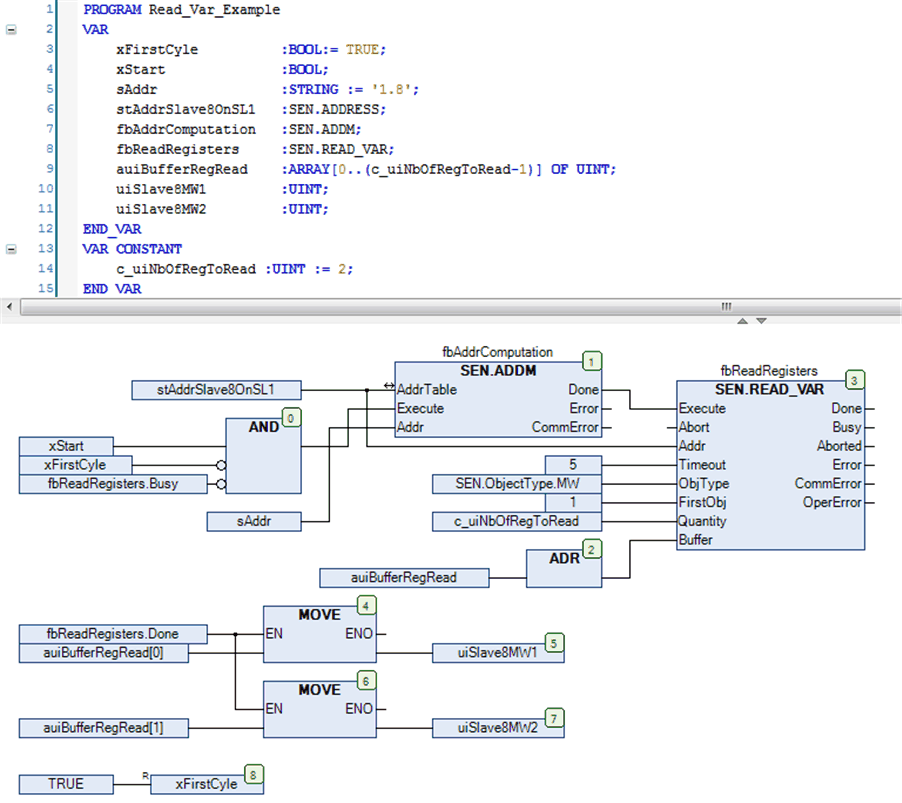

# `READ_VAR`: Read Data from a Modbus Device

## Function Description

The `READ_VAR` function block reads data from an external device in the Modbus protocol.

## Graphical Representation

## `READ_VAR` - Specific Parameter Description

| Input | Type | Comment |
| --- | --- | --- |
| `ObjType` | ObjectType | `ObjType` is the [type of object to be read (MW, I, IW, Q)](D-RU-0004904.html#D-RU-0004904__D-RU-0004904.3). |
| `FirstObj` | DINT | `FirstObj` is the index of the first object to be read. |
| `Quantity` | UINT | `Quantity` is the number of objects to be read:   * 1...125: registers (MW and IW types) * 1...2000: bits (I and Q types) |
| `Buffer` | POINTER TO BYTE | Pointer address to the array that holds the received data which have been read from the target device. The array must be equal or greater than the data which shall be read. For example, the reading of 4 registers requires an array of 4 words and the reading of 32 bits requires an array of 2 words or 4 bytes, each bit of which is set to the corresponding value of the remote device. You must use the ADR function to pass the address of the first byte of the array (see CFC chart in the [example](#D-RU-0004974__D-RU-0004974.14)). |

NOTE: To prevent access violation caused by invalid pointer access (out of bounds) to the memory, you must ensure the size of the linked array to the input Buffer is equal or greater than the data which will be received from the target device. It is a good practice to link the defined Quantity of data to read to the declaration of the buffer like done in the following example.

[The input and output parameters that are common to all PLCCommunication library function blocks are described elsewhere](D-SE-0002222.html#D-SE-0002222__D-SE-0002222.6).

## Example

This example shows the implementation of the `READ_VAR` function block in conjunction with the `ADDM` function block in order to read two registers starting at address 1 from a Modbus slave. The Modbus slave is specified with address 8 and must be reachable through serial line interface 1. A precondition is the configuration of the Modbus Manager as master under the serial line interface 1.

This figure shows the declaration and use of the `READ_VAR` function:

EIO0000002962.02