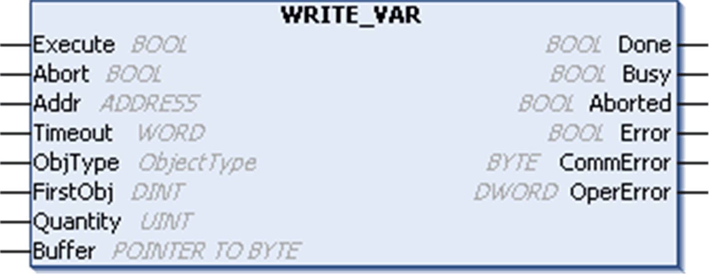
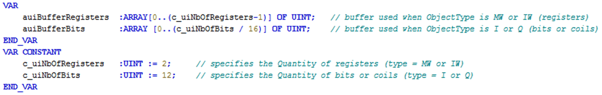
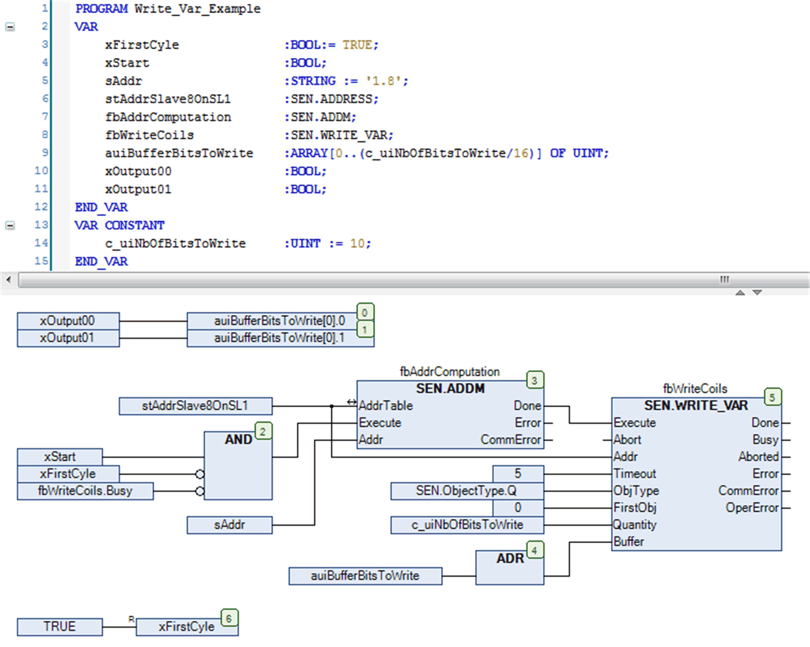

# `WRITE_VAR`: Write Data to a Modbus Device

## Function Description

The `WRITE_VAR` function block writes data to an external device in the Modbus protocol.

## Graphical Representation

## `WRITE_VAR` - Specific Parameter Description

| Input | Type | Comment |
| --- | --- | --- |
| `ObjType` | ObjectType | `ObjType` describes the [type of object(s) to write (MW, Q)](D-RU-0004904.html#D-RU-0004904__D-RU-0004904.3). |
| `FirstObj` | DINT | `FirstObj` is the index of the first object to write. |
| `Quantity` | UINT | `Quantity` is the number of objects to be read:   * 1...123: registers (MW type) * 1...1968: bits (Q type) |
| `Buffer` | POINTER TO BYTE | Pointer address to the array that holds the data which shall be written to the target device. The array must be equal or greater than the data which shall be written. For example, if 4 registers shall be written an array of 4 words is required and the writing of 32 bits require an array of 2 words or 4 bytes, each bit of which is set to the corresponding value. You must use the ADR function to pass the address of the first byte of the array (see CFC chart in the [example](#D-RU-0004977__D-RU-0004977.14)). |

NOTE: To prevent access violation caused by invalid pointer access (out of bounds) to the memory, you must ensure the size of the linked array to the input Buffer is equal or greater than the data which will be written to the target device. It is a good practice to link the defined Quantity of data to write to the declaration of the buffer like done in the following example.

[The input and output parameters that are common to all PLCCommunication library function blocks are described elsewhere](D-SE-0002222.html#D-SE-0002222__D-SE-0002222.6).

| WARNING | |
| --- | --- |
|  | EXCHANGED DATA INCOMPATIBILITY  Verify that the exchanged data are compatible because data structure alignments are not the same for all devices.  Failure to follow these instructions can result in death, serious injury, or equipment damage. |

## Example

This example shows the implementation of the `WRITE_VAR` function block in conjunction with the `ADDM` function block in order to write 10 outputs (coils) starting at address 0 of a Modbus slave. The Modbus slave is specified with address 8 and must be reachable through the serial line interface 1. A precondition is the configuration of the Modbus Manager as master under the serial line interface 1.

EIO0000002962.02