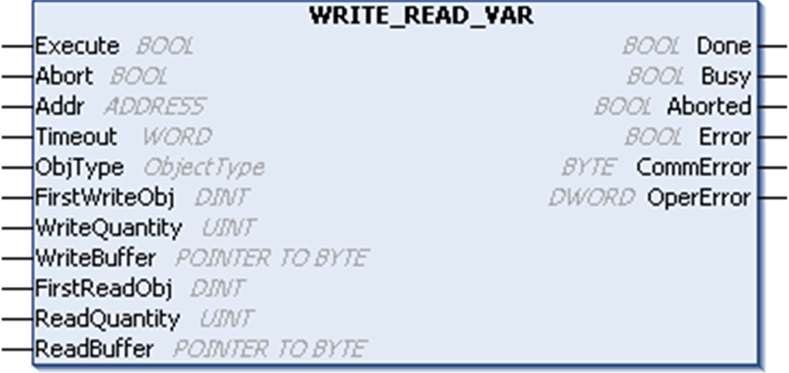
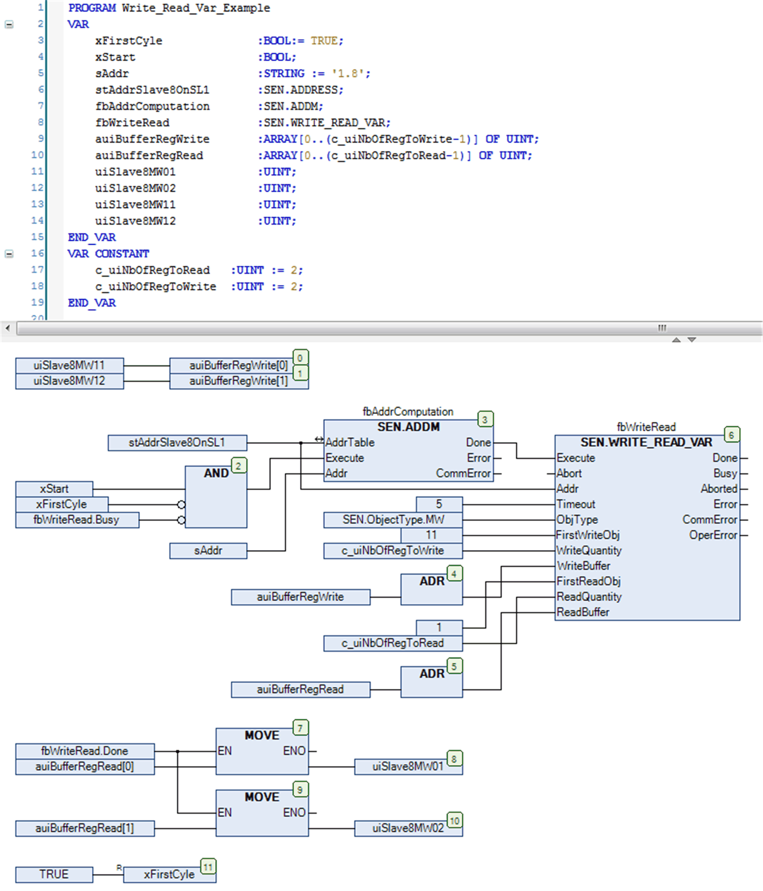

# `WRITE_READ_VAR`: Read and Write Internal Registers on a Modbus Device

## Function Description

This function reads and writes internal registers (MW type only) to an external device in the Modbus protocol. The read and write operations are contained in a single transaction.

The write operation is performed first. The `WRITE_READ_VAR` function can then:

* write consecutive internal registers and immediately read back their values for verification
* write some consecutive internal registers and read others in a single unique request

## Graphical Representation

## `WRITE_READ_VAR` - Specific Parameter Description

| Input | Type | Comment |
| --- | --- | --- |
| `ObjType` | [ObjectType](D-RU-0004904.html#D-RU-0004904) | `ObjType` is the object type to be written and read (MW only). |
| `FirstWriteObj` | DINT | `FirstWriteObj` is the index of the first object to write. |
| `WriteQuantity` | UINT | `WriteQuantity` is the number of objects to write:   * 1...121: registers (MW type) |
| `WriteBuffer` | POINTER TO BYTE | Pointer address to the array that holds the data which shall be written to the target device. The array must be equal or greater than the data which shall be written. You must use the ADR function to pass the address of the first byte of the array (see CFC chart in the [example](#D-RU-0004976__D-RU-0004976.14)). |
| `FirstReadObj` | DINT | `ReadFirstObj` is the index of the first object to be read. |
| `ReadQuantity` | UINT | `ReadQuantity` represents the number of objects to be read:   * 1...125: registers (MW type) |
| `ReadBuffer` | POINTER TO BYTE | Pointer address to the array that holds the received data which have been read from the target device. The array must be equal or greater than the data which shall be read. You must use the ADR function to pass the address of the first byte of the array (see CFC chart in the [example](#D-RU-0004976__D-RU-0004976.14)). |

NOTE: To prevent access violation caused by invalid pointer access (out of bounds) to the memory, you must ensure the size of the linked array to the input Buffer is equal or greater than the data which will be written to or received from the target device. It is a good practice to link the defined Quantity of data to write or to read to the declaration of the buffer like done in the following example.

[The input and output parameters that are common to all PLCCommunication library function blocks are described elsewhere](D-SE-0002222.html#D-SE-0002222__D-SE-0002222.6).

## Example

This example shows the implementation of the `WRITE_READ_VAR` function block in conjunction with the `ADDM` function block in order to write two registers starting at address 11 and to read two registers staring at address 1 of a Modbus slave. The Modbus slave is specified with address 8 and must be reachable through the serial line interface 1. A precondition is the configuration of the Modbus Manager as master under the serial line interface 1.

EIO0000002962.02