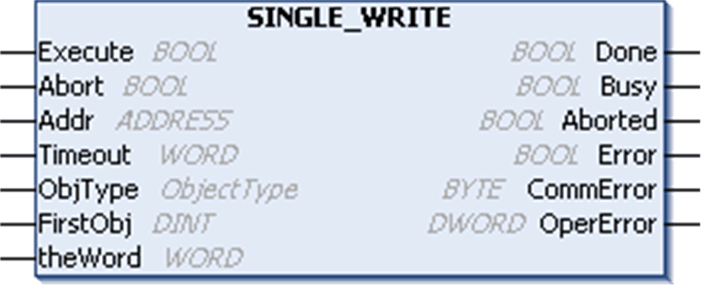

# `SINGLE_WRITE`: Write a Single Register to a Modbus Device

## Function Description

The `SINGLE_WRITE` function block writes a single internal register to an external Modbus device.

## Graphical Representation

## `SINGLE_WRITE` - Specific Parameter Description

| Input | Type | Comment |
| --- | --- | --- |
| `ObjType` | ObjectType | `ObjType` describes the [type of object(s) to write (MW only)](D-RU-0004904.html#D-RU-0004904__D-RU-0004904.3). |
| `FirstObject` | DINT | `FirstObject` is the index of the object to write. |
| `theWord` | WORD | This input contains the value to write. |

[The input and output parameters that are common to all PLCCommunication library function blocks are described elsewhere](D-SE-0002222.html#D-SE-0002222__D-SE-0002222.6).

## Example

This example shows the implementation of the `SINGLE_WRITE` function block in conjunction with the `ADDM` function block in order to write a single register at address 11 of a Modbus slave. The Modbus slave is specified with address 8 and must be reachable through the serial line interface 1. Precondition is the configuration of the Modbus Manager as master under the serial line interface 1.

EIO0000002962.02