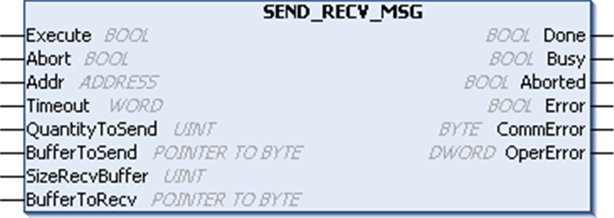
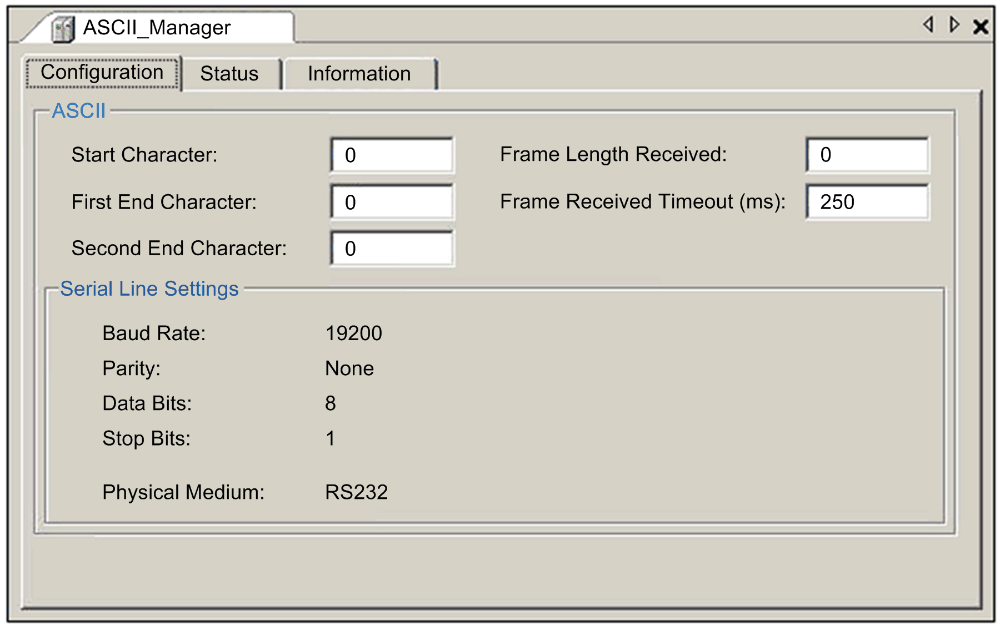
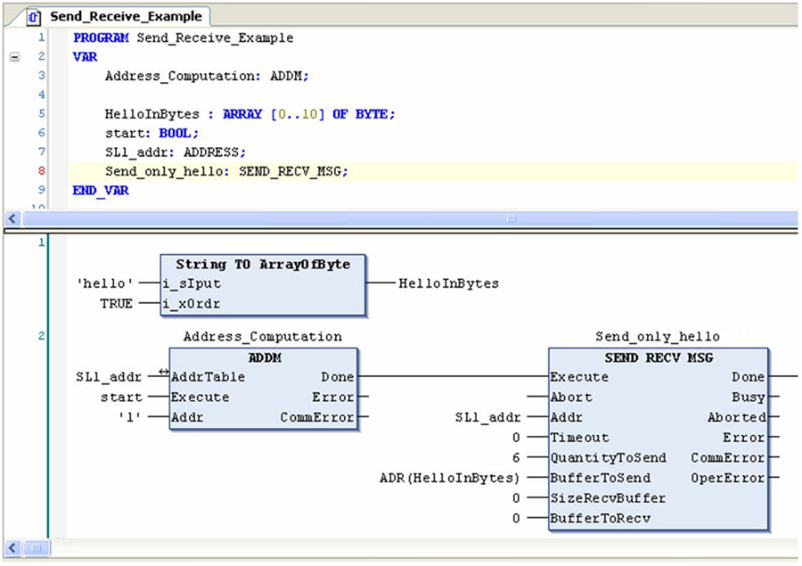

# SEND\_RECV\_MSG: Send and/or Receive User-Defined Messages

## Function Description

The SEND\_RECV\_MSG function block sends and receives user-defined messages. It sends a message on the selected media (for example, a serial line) and then waits for a response. It is also possible to either send without waiting for a response or to receive a message without sending one.

This function should be used with an ASCII manager. It could also be used with a Modbus manager if you want to send a request that is not implemented in the communication library. In this case, you have to build the request yourself.

## Graphical Representation

## SEND\_RECV\_MSG-Specific Parameter Descriptions

| Input | Type | Comment |
| --- | --- | --- |
| QuantityToSend | UINT | QuantityToSend is the number of bytes to send.  Controller limitation:   * M258/LMC058: 1050 bytes * M241/M251/M262: 252 bytes |
| BufferToSend | POINTER TO BYTE | BufferToSend is the address of the buffer (array of bytes) in which the message to send is stored. The ADR standard function must be used to define the associated pointer. (See the example below.) If 0, the function makes a receive-only. |
| SizeRecvBuffer | UINT | SizeRecvBuffer is the available size (in bytes) of the receive buffer.  The size of the received data (in bytes) is available in the function block instance internal property (internal variable): <Instance Name>.NbRecvBytes.  Controller limitation:   * M258/LMC058: 1050 bytes * M241/M251/M262: 252 bytes |
| BufferToRecv | POINTER TO BYTE | BufferToRecv is the address of the buffer (array of SizeRecvBuffer bytes) in which the received message is stored. The ADR standard function must be used to define the associated pointer. (See the example below.) If 0, the function makes a send-only. |

For send only operations, the exchange is complete (Busy reset to 0) when all data (including eventual start and stop characters) have been sent to the line.

For a send/receive or receive only operation, the system receives characters until the ending condition. When the ending condition is reached, the exchange is complete (Busy reset to 0). Received characters are then copied into the receive buffer up to SizeRecvBuffer characters and the size of the received data (in bytes) is available in function block instance property (internal variable): <Instance Name>.NbRecvBytes. The SizeRecvBuffer input does not represent an ending condition.

[The input and output parameters that are common to all PLCCommunication library function blocks are described elsewhere](D-SE-0002222.html#D-SE-0002222__D-SE-0002222.6).

The starting and ending conditions of user-defined messages are configured in the ASCII manager's configuration dialog box:

NOTE: There are no start and end characters in this example. The received frame ending condition is a 250 ms timeout.

## Example

This POU allows the send-only of the user-defined message “hello” on serial line 1:

NOTE: A rising edge on the Start variable launches the conversion of an address and the sending of the message.

EIO0000002962.02