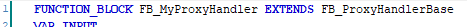

# General Information

## Overview

|  |  |
| --- | --- |
| Type: | Interface |
| Available as of: | V1.0.2.0 |
| Inherits from: | - |

## Description

This function block is provided to be extended by a custom function block which implements the functionality to communicate with the proxy server. The FB\_ProxyHandlerBase function block implements the interface IF\_ProxyHandler and thus the methods and properties defined by the interface.

In addition to the interface methods, it also provides properties for configuring the basic connection settings for the proxy server.

Each method of this function block provides the essential logic for a basic implementation. In principle, only the method ConnectToRemoteServer is required to be overwritten, because this method must implement the proxy specific data exchange for passing through the connection to remote server.

When you create your own proxy handler function block use the keyword EXTENDS in combination with the function block name. In this way, your function block inherits the methods, properties, and local variables of the base function block.

EIO0000004579.01

© 2022

Schneider Electric.

All rights reserved.