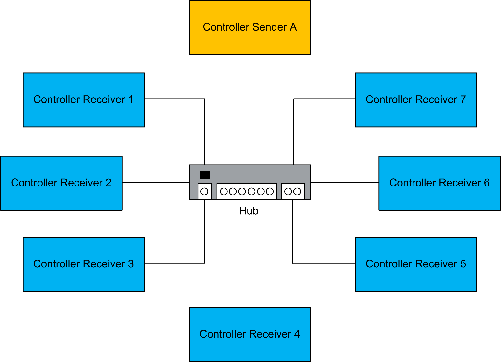

# NVL Considerations

NVL Considerations

The following table shows the list of controllers that support the network variables list (NVL) functionality:

| Function Name | M241 | M251 | M258  LMC058 | M262 | LMC Eco  LMC Pro  LMC Pro2 |
| --- | --- | --- | --- | --- | --- |
| Network Variables List | Yes | Yes | Yes | Yes | Yes |

The figure shows a network consisting of 1 sender and the maximum of 7 receivers:

Controller Sender A:   Sender with the global variables list (GVL) and receiver controller with global network variables lists (GNVLs)

Controller Receiver 1...7:   Receivers (with GNVL) from A and sender controller (GVL) only for A