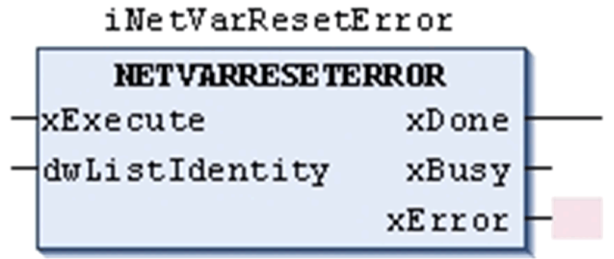

# Function Block Description

Function Block Description

The function block NETVARRESETERROR restarts the communication exchange of variables after an NVL error is detected.

This function block resets detected duplicate list identifiers which are indicated by the output parameters dwDuplicateListIdIp1 or dwDuplicateListIdIp2 of the function block NETVARGETDIAGINFO.

