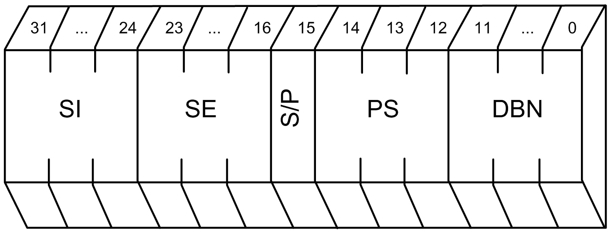

# Sercos Identification Number

## Sercos Parameter Identification Number (IDN)

A Sercos parameter is addressed via the identification number (IDN). The IDN is a 32-bit value. The following figure describes the structure of the IDN.

Symbolic addressing: `<S/P>-<PS>-<DBN>.<SI>.<SE>`

| Abbreviation | Description | Values |
| --- | --- | --- |
| `SI` | Structure Instance | 0...255 |
| `SE` | Structure Element | 0...255 |
| `S/P` | S/P parameter  S are Sercos specific parameters.  P are manufacturer specific parameters. | 0 = S  1 = P |
| `PS` | Parameter Set | 0...7 |
| `DBN` | Data Block Number | 0...4095 |

EIO0000002208.03