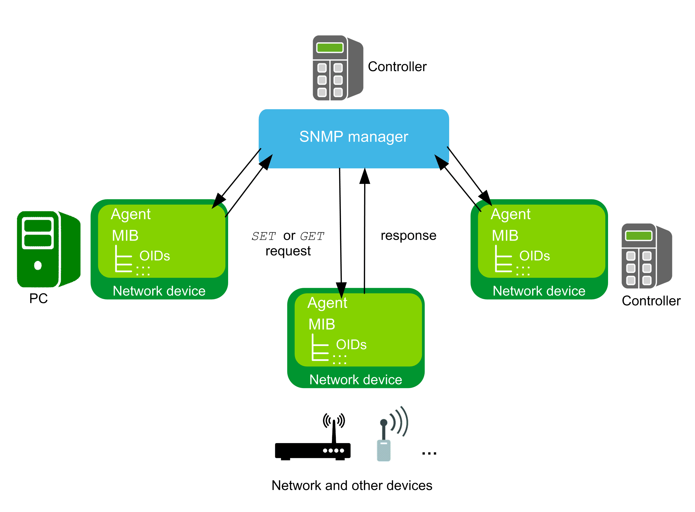

# General Information

## Library Overview

The SnmpManager library implements a manager for the Internet standard protocol SNMP (Simple Network Management Protocol). The SNMP manager allows your controller to collect and organize information about managed devices on IP (Internet Protocol) networks and to modify this information in order to change the configuration of the device.

The SNMP manager is able to communicate with managed devices over:

* SNMPv1 protocol as defined in the IETF RFC 1157
* SNMPv2c protocol (community-based) as defined in the IETF RFC 1901...1907
* SNMPv3 protocol as defined in the IETF RFC 3412, 3414 and 3826

It provides the following functions:

* Generating and transmitting a GET request for one Object IDentifier (OID).
* Generating and transmitting a SET request for one OID.
* Receiving and structuring the response of the agent.
* Providing the decoded value from a response in a suitable system type.
* Encoding a given value for a corresponding SET request.
* Managing detected errors.
* Managing authentication requests.
* Encrypting the Protocol Data Unit (PDU) of a request.

An agent can be any network device providing SNMP functionality such as switches, routers, printers, or other controllers. You must provide the information about the specific Management Information Base (MIB) structure and the corresponding OIDs for each agent.

## Characteristics of the Library

The following table indicates the characteristics of the library:

| Characteristic | Value |
| --- | --- |
| Library title | SnmpManager |
| Company | Schneider Electric |
| Category | Communication |
| Component | Internet protocol suite |
| Default namespace | SE\_SNMP |
| Language model attribute | [Qualified-access-only](../../../../../api/crossBook?lang=en-US&virtualBookName=SoLibref&topicID=D_SE_0081219) |
| Forward compatible library | Yes ([FCL](../../../../../api/crossBook?lang=en-US&virtualBookName=SoLibref&topicID=D_SE_0081226)) |

NOTE: For this library, qualified-access-only is set. This means that the POUs, data structures, enumerations, and constants must be accessed using the namespace of the library. The default namespace of the library is SE\_SNMP.

## General Considerations

Consider the following limitations for SNMP communication:

* Only Internet Protocol version 4 (IPv4) is supported.
* Only one request to one SNMP agent is allowed at a time.
* Only one OID can be processed per request.
* The SnmpManager library incorporates pointers on addresses.

Executing the Online Change command can change the contents of addresses.

| CAUTION | |
| --- | --- |
|  | INVALID POINTER  Verify the validity of the pointers when using pointers on addresses and executing the Online Change command.  Failure to follow these instructions can result in injury or equipment damage. |

The SNMP Manager Library is based on the UDP communications.

NOTE: The UDP protocol does not establish a dedicated end-to-end connection. The communication between the peers is achieved by transmitting information from source to destination. It does not allow you to verify if a message reached its destination peer or information was lost during the transfer. The UDP protocol does not provide any concept of acknowledgment, retransmission, or timeout.

The library described in this document internally uses the TcpUdpCommunication library.

The TcpUdpCommunication (Schneider Electric) and the CAA Net Base Services library (CAA Technical Workgroup) use the same system resources on the controller. The simultaneous use of both libraries in the same application may lead to disturbances during the operation of the controller.

| WARNING | |
| --- | --- |
|  | UNINTENDED EQUIPMENT OPERATION  Do not use the library TcpUdpCommunication (Schneider Electric) and the CAA Net Base Services (CAA Technical Workgroup) library at the same time.  Failure to follow these instructions can result in death, serious injury, or equipment damage. |

## Considerations Concerning Cybersecurity

The SnmpManager library functions do not support secure connections such as Transport Layer Security (TLS) or Secure Socket Layer (SSL). Communication must only be performed inside your industrial network, isolated from other networks inside your company, and protected from the Internet.

NOTE: Schneider Electric adheres to industry best practices in the development and implementation of control systems. This includes a "Defense-in-Depth" approach to secure an Industrial Control System. This approach places the controllers behind one or more firewalls to restrict access to authorized personnel and protocols only.

| WARNING | |
| --- | --- |
|  | UNAUTHENTICATED ACCESS AND SUBSEQUENT UNAUTHORIZED MACHINE OPERATION  * Evaluate whether your environment or your machines are connected to your critical infrastructure and, if so, take appropriate steps in terms of prevention, based on Defense-in-Depth, before connecting the automation system to any network. * Limit the number of devices connected to a network to the minimum necessary. * Isolate your industrial network from other networks inside your company. * Protect any network against unintended access by using firewalls, VPN, or other, proven security measures. * Monitor activities within your systems. * Prevent subject devices from direct access or direct link by unauthorized parties or unauthenticated actions. * Prepare a recovery plan including backup of your system and process information.  Failure to follow these instructions can result in death, serious injury, or equipment damage. |

For more information on organizational measures and rules covering access to infrastructures, refer to ISO/IEC 27000 series, Common Criteria for Information Technology Security Evaluation, ISO/IEC 15408, IEC 62351, ISA/IEC 62443, NIST Cybersecurity Framework, Information Security Forum - Standard of Good Practice for Information Security and refer to [Cybersecurity Guidelines for EcoStruxure Machine Expert, Modicon and PacDrive Controllers and Associated Equipment](https://www.se.com/ww/en/download/document/EIO0000004242/).

EIO0000002797.02