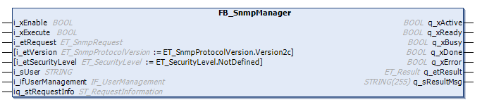

# FB\_SnmpManager

## Overview

|  |  |
| --- | --- |
| Type: | Function block |
| Available as of: | V1.0.0.0 |

## Task

The FB\_SnmpManager function block is used to perform SNMP requests to managed devices on Internet Protocol (IP) networks.

## Functional Description

The FB\_SnmpManager function block is the user interface for SNMP communications.

Only one request to one agent can be managed at a time.

The function block must be enabled and ready to perform a request. When starting the execution of a request, the inputs i\_etRequest and iq\_stRequestInfo need to be set. The information from the inputs is used to build an SNMP telegram containing the request, and then to send it through UDP to the agent. The i\_ifUserManagement input is used to reference the FB\_SnmpManager instance containing the user specified at the i\_sUser input. The user data are used to authenticate and encrypt the SNMPv3 request. The function block waits for a response from the agent, processes it and presents the received information at iq\_stRequestInfo.stResponse. As long as the function block is executing a request, the output q\_xBusy is set to TRUE and q\_etResult shows the state of operation. The output q\_xDone signals a successful execution and q\_xError shows if the function block detects an error during execution with q\_etResult and q\_sResultMsg presenting further information on the nature or cause of the detected error. If an error is detected, the function block needs to be reset by disabling and re-enabling it.

## Interface

| Input | Data type | Description |
| --- | --- | --- |
| i\_xEnable | BOOL | Activation and initialization of the function block. |
| i\_xExecute | BOOL | The command specified at i\_etRequest is executed upon rising edge of this input. |
| i\_etRequest | [ET\_SnmpRequest](D-SE-0081033.html) | The SNMP request that is executed if i\_xExecute is TRUE. Make sure that iq\_stRequestInfo is available before the SNMP request is executed. |
| i\_etVersion | [ET\_SnmpProtocolVersion](D-SE-0081034.html) | Specifies protocol version for communication with the agent. Default value is ET\_SnmpProtocolVersion.Version2c. |
| i\_etSecurityLevel | [ET\_SecurityLevel](ET_SecurityLevel-7E726DAE.html) | Level of security at which SNMPv3 messages are sent.  NOTE: The user account specified at i\_sUser needs to be configured according to the selected security level. |
| i\_sUser | STRING | Name of the user account to authenticate and encrypt the SNMPv3 request. |
| i\_ifUserManagement | [IF\_UserManagement](IF_UserMan-7F53CD30.html) | Reference to the FB\_UserManagement instance where the user account was created.  NOTE: This input can be ignored if no user account is specified at i\_sUser. |

| Input / Output | Data type | Description |
| --- | --- | --- |
| iq\_stRequestInfo | ST\_RequestInformation | Used to pass the structure containing information for sending a request to an agent and the structure to present the received response from the agent. |

| Output | Data type | Description |
| --- | --- | --- |
| q\_xActive | BOOL | If the function block is active, this output is set to TRUE. |
| q\_xReady | BOOL | If the initialization is successful, this output signals a TRUE as long as the function block is capable of accepting inputs. |
| q\_xBusy | BOOL | If this output is set to TRUE, the function block is executing the command specified at i\_etRequest. |
| q\_xDone | BOOL | If this output is set to TRUE, the function block has successfully completed the command specified at i\_etRequest. Additional data is provided at iq\_stRequestInfo.q\_stResponse. |
| q\_xError | BOOL | If this output is set to TRUE, an error has been detected. For details, refer to q\_etResult and q\_etResultMsg. |
| q\_etResult | ET\_Result | Provides diagnostic and status information. |
| q\_sResultMsg | STRING[255] | Provides additional diagnostic and status information. |

EIO0000002797.02