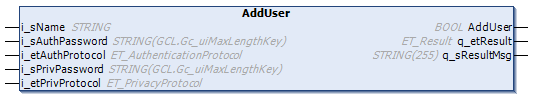

# FB\_UserManagement - AddUser (Method)

## Overview

|  |  |
| --- | --- |
| Type: | Function block |
| Available as of: | V1.3.4.0 |

## Task

Create a user account by providing information related to authentication and encryption.

## Functional Description

The AddUser method is used to create a user account by providing information related to authentication and encryption.

## Interface

| Input | Data type | Description |
| --- | --- | --- |
| i\_sName | STRING | Name of the user account. |
| i\_sAuthPassword | STRING(GCL\_internal.Gc\_uiMaxLengthKey) | Authentication password for use with the authentication protocol. |
| i\_etAuthProtocol | [ET\_AuthenticationProtocol](ET_AuthProt-7E73E7DA.html) | Type of authentication protocol that is used to authenticate the messages sent on behalf of this user account. |
| i\_sPrivPassword | STRING(GCL\_internal.Gc\_uiMaxLengthKey) | Privacy password for use with the privacy protocol. |
| i\_etPrivProtocol | [ET\_PrivacyProtocol](ET_PrivProt-7E75F423.html) | Type of privacy protocol that is used to protect the messages sent on behalf of this user account from disclosure. |

## Return Value

| Output | Data type | Description |
| --- | --- | --- |
| AddUser | BOOL | Indicates TRUE if the user account has been created. |
| q\_etResult | ET\_Result | Provides diagnostic and status information. |
| q\_sResultMsg | STRING[255] | Provides additional diagnostic and status information. |

EIO0000002797.02