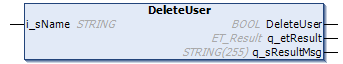

# FB\_UserManagement - DeleteUser (Method)

## Overview

|  |  |
| --- | --- |
| Type: | Function block |
| Available as of: | V1.3.4.0 |

## Task

Delete a user account.

## Functional Description

The DeleteUser method is used to delete a user account.

## Interface

| Input | Data type | Description |
| --- | --- | --- |
| i\_sName | STRING | Name of the user account to be deleted. |

## Return Value

| Output | Data type | Description |
| --- | --- | --- |
| DeleteUser | BOOL | Indicates TRUE if the user account has been deleted. |
| q\_etResult | ET\_Result | Provides diagnostic and status information. |
| q\_sResultMsg | STRING[255] | Provides additional diagnostic and status information. |

EIO0000002797.02