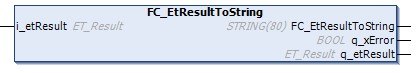

# FC\_EtResultToString

## Overview

|  |  |
| --- | --- |
| Type: | Function |
| Available as of: | V1.0.0.0 |
| Inherits from: | – |
| Implements: | – |

## Task

Convert an ET\_Result enumeration element to a STRING variable.

## Functional Description

The FC\_EtResultToString is used to convert an ET\_Result element variable to a STRING variable.

## Interface

| Input | Data type | Description |
| --- | --- | --- |
| i\_etResult | ET\_Result | Enumeration with the result. |

| Output | Data type | Description |
| --- | --- | --- |
| q\_xError | BOOL | If this output is set to TRUE, an error has been detected. |
| q\_etResult | ET\_Result | Enumeration with the result. |

## Return Value

| Data type | Description |
| --- | --- |
| STRING[80] | The ET\_Result converted to text. |

EIO0000002797.02