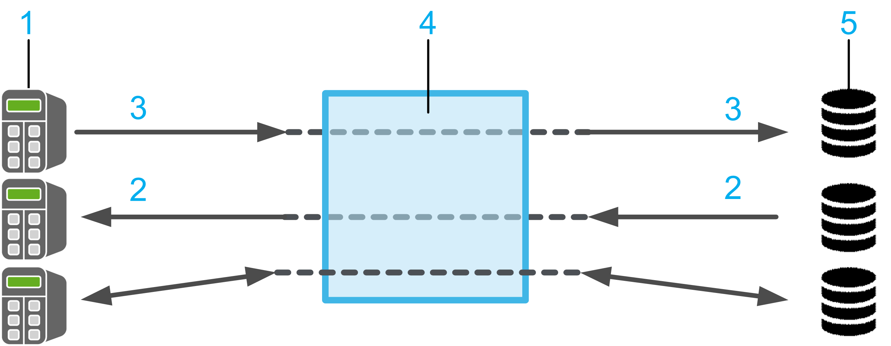

# General Information

## Library Overview

The library SqlRemoteAccess provides SQL (Structured Query Language) client function blocks that allow your controller to connect to an SQL database in order to run SQL queries for reading and writing data.

The communication between the controller that acts as an SQL client and the SQL database server is running via the Schneider Electric SQL Gateway. Therefore, you have to install the SQL Gateway that is supplied with EcoStruxure Machine Expert as an optional component and that requires a specific license before you can use the SQL function. For further information, refer to the [SQL Gateway User Guide](../../../../../api/crossBook?lang=en-US&virtualBookName=sqlgatUG&topicID=D_SE_0064149).

**1** 1...n controllers (SQL clients)

**2** Read data

**3** Write data

**4** SQL Gateway

**5** 1...n database servers

After successful installation, the controller can send a customized SQL query to the database server, for example:

* Querying data from tables.
* Inserting, changing, and deleting data in tables.
* Executing database procedures.

## Characteristics of the Library

The following table indicates the characteristics of the library:

| Characteristic | Value |
| --- | --- |
| Library title | SqlRemoteAccess |
| Company | Schneider Electric |
| Category | Communication |
| Component | SQL Library |
| Default namespace | SE\_SQL |
| Language model attribute | [Qualified-access-only](../../../../../api/crossBook?lang=en-US&virtualBookName=SoLibref&topicID=D_SE_0081219) |
| Forward compatible library | Yes ([FCL](../../../../../api/crossBook?lang=en-US&virtualBookName=SoLibref&topicID=D_SE_0081226)) |

NOTE: For this library, qualified-access-only is set. This means, that the POUs, data structures, enumerations, and constants have to be accessed using the namespace of the library. The default namespace of the library is SE\_SQL.

## Example Project

In conjunction with the library, the example project SQLRemoteAccessExample.project is provided. The example project shows how to implement the components from the SqlRemoteAccess library.

The example project is installed on your PC along with the programming software. To open the project example, proceed as follows:

| Step | Action | Comment |
| --- | --- | --- |
| 1 | In the EcoStruxure Machine Expert Logic Builder, execute the command New Project. | – |
| 2 | In the New Project dialog box, select From Example from the Project type list. | – |
| 3 | On the right-hand side of the New Project dialog box, click the button Toggle Filter. | **Result**: Available examples are listed in the drop down menu. |
| 4 | Select your example from the drop down menu. | – |
| 5 | Select your controller from the Controllers list. | – |
| 6 | Enter a name for the new project, and select the file location. | – |
| 7 | Click the OK button. | **Result**: A new project is created based on the selected example. |

## General Considerations

Consider the following limitations for SQL communications:

* Only IPv4 (Internet Protocol version 4) is supported.
* Only database data types supported which conform to IEC 61131-3.
* Read and write BLOB (Binary Large Objects) objects from and into a database is not supported.

The library described in this document internally uses the TcpUdpCommunication library.

The TcpUdpCommunication (Schneider Electric) and the CAA Net Base Services library (CAA Technical Workgroup) use the same system resources on the controller. The simultaneous use of both libraries in the same application may lead to disturbances during the operation of the controller.

| WARNING | |
| --- | --- |
|  | UNINTENDED EQUIPMENT OPERATION  Do not use the library TcpUdpCommunication (Schneider Electric) and the CAA Net Base Services (CAA Technical Workgroup) library at the same time.  Failure to follow these instructions can result in death, serious injury, or equipment damage. |

## Considerations Concerning Cybersecurity

The function block FB\_SqlDbRequest out of the SqlRemoteAccess library supports secured communication to the SQL Gateway using TLS (Transport Layer Security).

Whether a connection using TLS is supported depends on the controller where the FB\_SqlDbRequest is used. Refer to the specific manual of your controller to verify if TCP communication using TLS is supported.

Communication with unsecured connections must only be performed inside your industrial network, isolated from other networks inside your company, and protected from the Internet.

NOTE: Schneider Electric adheres to industry best practices in the development and implementation of control systems. This includes a "Defense-in-Depth" approach to secure an Industrial Control System. This approach places the controllers behind one or more firewalls to restrict access to authorized personnel and protocols only.

| WARNING | |
| --- | --- |
|  | UNAUTHENTICATED ACCESS AND SUBSEQUENT UNAUTHORIZED MACHINE OPERATION  * Evaluate whether your environment or your machines are connected to your critical infrastructure and, if so, take appropriate steps in terms of prevention, based on Defense-in-Depth, before connecting the automation system to any network. * Limit the number of devices connected to a network to the minimum necessary. * Isolate your industrial network from other networks inside your company. * Protect any network against unintended access by using firewalls, VPN, or other, proven security measures. * Monitor activities within your systems. * Prevent subject devices from direct access or direct link by unauthorized parties or unauthenticated actions. * Prepare a recovery plan including backup of your system and process information.  Failure to follow these instructions can result in death, serious injury, or equipment damage. |

For more information on organizational measures and rules covering access to infrastructures, refer to ISO/IEC 27000 series, Common Criteria for Information Technology Security Evaluation, ISO/IEC 15408, IEC 62351, ISA/IEC 62443, NIST Cybersecurity Framework, Information Security Forum - Standard of Good Practice for Information Security and refer to [Cybersecurity Guidelines for EcoStruxure Machine Expert, Modicon and PacDrive Controllers and Associated Equipment](https://www.se.com/ww/en/download/document/EIO0000004242/).

EIO0000002767.04