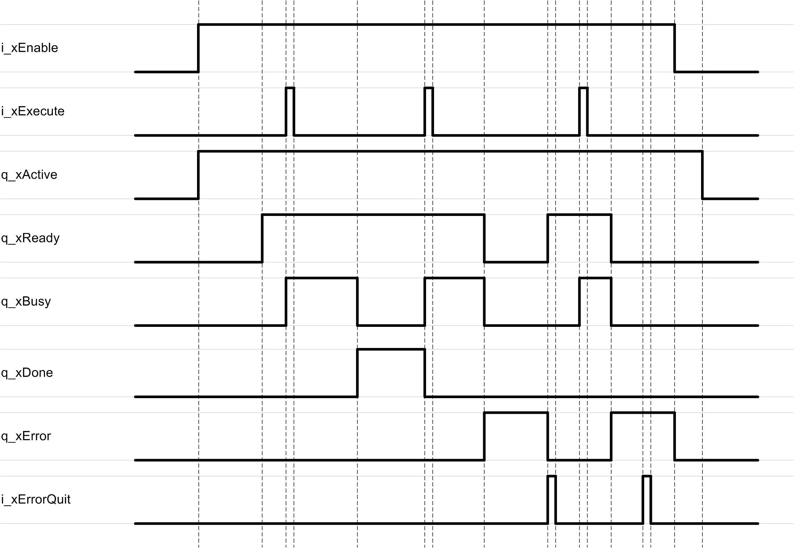

# Behavior of Function Blocks with the Inputs i\_xEnable and i\_xExecute and i\_xErrorQuit

## General Information

By setting the input i\_xEnable to TRUE, the function block starts the enabling process. The function block continues initialization and the output q\_xActive is set to TRUE. Once the initialization is finished and the function block is ready, the output q\_xReady is set to TRUE.

A rising edge of the input i\_xExecute starts the execution of the function block. The function block continues execution and the output q\_xBusy is set to TRUE. A rising edge at the input i\_xExecute is ignored while the function block is being executed.

Once the execution is finished, the outputs q\_xDone or q\_xError are set according to the result.

The output q\_xDone indicates a successful execution and it remains TRUE until the next rising edge of the input i\_xExecute.

If q\_xError indicates TRUE, an error has been detected during execution. A renewed execution of the function block is not possible as long the error state is present. Certain error messages can be reset using the input i\_xErrorQuit.

If the error state persists upon a rising edge of i\_xErrorQuit, the function block must be disabled in order to reset the error state.

By setting the input i\_xEnable to FALSE, the function starts the disabling process. Continue calling the function block as long as the output q\_xActive is TRUE.

## Example

EIO0000002767.04