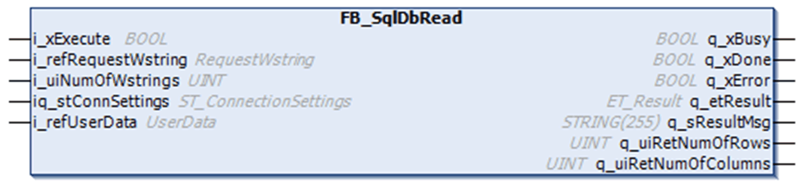

# FB\_SqlDbRead

## Overview

|  |  |
| --- | --- |
| Type: | Function block |
| Available as of: | V1.0.0.0 |

## Task

The FB\_SqlDbRead function block is used to perform SQL requests that read data from the SQL database. The return data is provided in a two-dimensional array of data whose size is defined with [global parameters](D-SE-0080899.html#D-SE-0080899__D-SE-0080899.7).

## Functional Description

The FB\_SqlDbRead function block is the user-interface for reading data from the SQL database.

After a rising edge on i\_xExecute has been detected, a connection to the SQL Gateway is established using the parameters defined in the structure ST\_ConnectionSettings. As soon as the connection has been established, the function block is capable of sending an SQL request to the SQL database.

Status messages and diagnostic information are provided using the outputs q\_xError (TRUE if an error has been detected), q\_etResult, and q\_etResultMsg.

## Interface

| Input | Data type | Description |
| --- | --- | --- |
| i\_xExecute | BOOL | The function block performs an SQL request in order to read data from the SQL database upon rising edge of this input.  For more information, also refer to [Behavior of Function Blocks with the Input i\_xExecute](i_xExecute-E1D1178E.html). |
| i\_refRequestWstring | REFERENCE TO [[RequestWstring]](D-SE-0080894.html#D-SE-0080894__D-SE-0080894.5) | Reference to the request data that contains one SQL query request (such as `Select * from DB limit 10;`).  Any SQL request must be divided into individual strings that do not exceed a length of 200 characters each.  Adapt the size of the [global parameters](D-SE-0080899.html#D-SE-0080899__D-SE-0080899.7) Gc\_uiMaxRequest and Gc\_uiRequestWstringLength according to the length of the SQL requests that you use in your application.  NOTE: To concatenate WSTRINGS, use the WCONCAT function of Standard64 library. |
| i\_uiNumOfWstrings | UINT | The number of needed WSTRINGS that contain the split SQL request.  The maximum number is limited by the [global parameter](D-SE-0080899.html#D-SE-0080899__D-SE-0080899.7) Gc\_uiMaxRequest. |
| i\_refUserData | REFERENCE TO [[UserData]](D-SE-0080894.html#D-SE-0080894__D-SE-0080894.6) | Reference to the UserData that must be available on the controller for storing the SQL data read from the database. |

| In\_Out | Data type | Description |
| --- | --- | --- |
| iq\_stConnSettings | ST\_ConnectionSettings | Contains the information for connecting to an SQL Gateway and information on the SQL database. |

| Output | Data type | Description |
| --- | --- | --- |
| q\_xBusy | BOOL | If this output is set to TRUE, the function block execution is in progress. |
| q\_xDone | BOOL | If this output is set to TRUE, the execution has been completed successfully. |
| q\_xError | BOOL | If this output is set to TRUE, an error has been detected. For details, refer to q\_etResult and q\_etResultMsg. |
| q\_etResult | ET\_Result | Provides diagnostic and status information. |
| q\_sResultMsg | STRING[255] | Provides additional diagnostic and status information. |
| q\_uiRetNumOfRows | UINT | Number of rows in the returning data.  This output is updated with the number of records which was received from the SQL database. |
| q\_uiRetNumOfColumns | UINT | Number of columns in the returning data.  This output is updated with the number of records which was received from the SQL database. |

For more information, also refer to [*Common Inputs and Outputs*](D-SE-0080730.html#D-SE-0080730).

## Defining an ARRAY of User Data

A two-dimensional ARRAY must be available on the controller for intermediate storage of SQL data read from the database. The two-dimensional ARRAY is defined in [ALIAS UserData](D-SE-0080894.html#D-SE-0080894__D-SE-0080894.6).

The size of the ARRAY can be adapted via the [global parameters](D-SE-0080899.html#D-SE-0080899) Gc\_uiMaxRows, Gc\_uiMaxColumns, and Gc\_uiTableWstringLength.

When you configure these parameters, consider the amount of SQL data that you expect to be received. Before data transfer is started, SQL data is segmented according to the size of this buffer.

If the SQL data that is received exceeds the size of the ARRAY, the SQL data transfer is stopped and the function block signals a detected error.

EIO0000002767.04