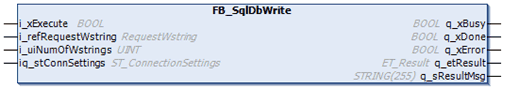

# FB\_SqlDbWrite

## Overview

|  |  |
| --- | --- |
| Type: | Function block |
| Available as of: | V1.0.0.0 |

## Task

The FB\_SqlDbWrite function block is used to perform SQL requests that update or modify the SQL database. The requests do not return any data.

## Functional Description

The FB\_SqlDbWrite function block is the user-interface for updating or modifying the SQL database.

After a rising edge on i\_xExecute has been detected, a connection to the SQL Gateway is established using the parameters defined in the structure [ST\_ConnectionSettings](D-SE-0080892.html). As soon as the connection has been established, the function block is capable to send one SQL request (given to input i\_refRequestWstring) to the SQL database.

Status messages and diagnostic information are provided using the outputs q\_xError (TRUE if an error has been detected), q\_etResult, and q\_etResultMsg.

## Interface

| Input | Data type | Description |
| --- | --- | --- |
| i\_xExecute | BOOL | The function block performs an SQL request in order to update or modify the SQL database upon rising edge of this input.  For more information, also refer to [Behavior of Function Blocks with the Input i\_xExecute](i_xExecute-E1D1178E.html). |
| i\_refRequestWstring | REFERENCE TO [[RequestWstring]](D-SE-0080894.html#D-SE-0080894__D-SE-0080894.5) | Reference to the request data that contains one SQL update request.  The following SQL query types are supported:   * `INSERT INTO` * `UPDATE` * `DELETE FROM` * `CREATE TABLE` * `CREATE VIEW` * `CREATE INDEX` * `ALTER TABLE` * `DROP TABLE` * `TRUNCATE TABLE`   Any SQL request must be divided into individual strings that do not exceed a length of 200 characters each.  Adapt the size of the [global parameters](D-SE-0080899.html#D-SE-0080899__D-SE-0080899.7) Gc\_uiMaxRequest and Gc\_uiRequestWstringLength according to the length of the SQL requests that you use in your application.  NOTE: To concatenate WSTRINGS, use the CONCAT function of Standard64 library. |
| i\_uiNumOfWstrings | UINT | The number of needed WSTRINGS that contain the split SQL request.  The maximum number is limited by the [global parameter](D-SE-0080899.html#D-SE-0080899__D-SE-0080899.7) Gc\_uiMaxRequest. |

| In\_Out | Data type | Description |
| --- | --- | --- |
| iq\_stConnSettings | [ST\_ConnectionSettings](D-SE-0080892.html) | Contains the information for connecting to an SQL Gateway and information on the SQL database. |

| Output | Data type | Description |
| --- | --- | --- |
| q\_xBusy | BOOL | If this output is set to TRUE, the function block execution is in progress. |
| q\_xDone | BOOL | If this output is set to TRUE, the execution has been completed successfully. |
| q\_xError | BOOL | If this output is set to TRUE, an error has been detected. For details, refer to q\_etResult and q\_etResultMsg. |
| q\_etResult | ET\_Result | Provides diagnostic and status information. |
| q\_sResultMsg | STRING[255] | Provides additional diagnostic and status information. |

For more information, also refer to [*Common Inputs and Outputs*](D-SE-0080730.html#D-SE-0080730).

EIO0000002767.04