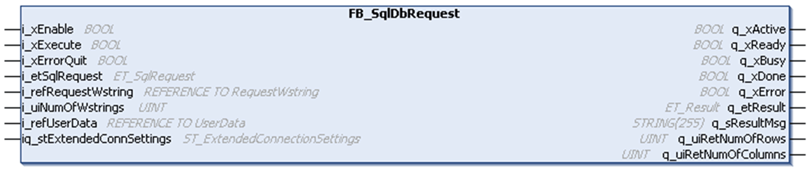

# FB\_SqlDbRequest

## Overview

|  |  |
| --- | --- |
| Type: | Function block |
| Available as of: | V2.0.0.0 |

## Task

The FB\_SqlDbRequest function block is used to:

* Establish a permanent and either secured or unsecured TCP connection to the SQL Gateway. For more details, refer to [ST\_ExtendedConnectionSettings](D-SE-0099875.html).
* Perform SQL requests that read data from the SQL database. The return data is provided in a two-dimensional array of data whose size is defined with [global parameters](D-SE-0080899.html#D-SE-0080899__D-SE-0080899.7).
* Perform SQL requests that update or modify the SQL database. The requests do not return any data.

## Functional Description

After the function block has been enabled (i\_xEnable is set to TRUE), a TCP connection (either secured via TLS V1.2 or unsecured) to the SQL Gateway is established using the settings defined in the variable iq\_stExtendedConnSettings.

As soon as the connection has been established, the output q\_xReady is set to TRUE, and the function block is able to send SQL requests to the SQL Gateway, which forwards the requests to the SQL database configured by using the connection name.

After a rising edge on i\_xExecute has been detected, the function block is sending the SQL request to the SQL Gateway and is processing the response.

Status messages and diagnostic information are provided using the outputs q\_xError (TRUE if an error has been detected), q\_etResult, and q\_etResultMsg.

Diagnostic messages in case of an unsuccessful command execution can be acknowledged by setting the input i\_xErrorQuit to TRUE. The function block remains active and the TCP connection is not closed.

After the data exchange with the SQL database is completed, disable the function block. Set i\_xEnable to FALSE to close the connection.

NOTE:

Whether a connection using TLS is supported depends on the controller where the FB\_SqlDbRequest is used. Refer to the specific manual of your controller to verify if TCP communication using TLS is supported.

## Interface

| Input | Data type | Description |
| --- | --- | --- |
| i\_xEnable | BOOL | The function block establishes a connection to the SQL Gateway upon a rising edge of this input.  If the input is set to FALSE, the function block is reset and an existing connection is closed or the connection establishment is aborted.  For more information, also refer to [Behavior of Function Blocks with the Inputs i\_xEnable and i\_xExecute and i\_xErrorQuit](i_xErrorQuit-145B4D67.html). |
| i\_xExecute | BOOL | The function block performs an SQL request in order to read or write data from or to the SQL database upon rising edge of this input.  For more information, also refer to [Behavior of Function Blocks with the Inputs i\_xEnable and i\_xExecute and i\_xErrorQuit](i_xErrorQuit-145B4D67.html). |
| i\_xErrorQuit | BOOL | The function block acknowledges a detected error indicated by q\_xError upon a rising edge of this input.  For more information, also refer to [Behavior of Function Blocks with the Inputs i\_xEnable and i\_xExecute and i\_xErrorQuit](i_xErrorQuit-145B4D67.html). |
| i\_etSqlRequest | [ET\_SqlRequest](D-SE-0099874.html#D-SE-0099874__D-SE-0099874.3) | Defines which type of SQL request (read or write) is to be executed.  Default: ET\_SqlRequest.Read |
| i\_refRequestWstring | REFERENCE TO [[RequestWstring]](D-SE-0080894.html#D-SE-0080894__D-SE-0080894.5) | Reference to the request data that contains one SQL query request (either for read or write).  Any SQL request must be divided into individual strings that do not exceed a length of 200 characters each.  Adapt the size of the [global parameters](D-SE-0080899.html#D-SE-0080899__D-SE-0080899.7) Gc\_uiMaxRequest and Gc\_uiRequestWstringLength according to the length of the SQL requests that you use in your application.  NOTE: To concatenate WSTRINGS, use the WCONCAT function of Standard64 library. |
| i\_uiNumOfWstrings | UINT | The number of needed WSTRINGS that contain the split SQL request.  The maximum number is limited by the [global parameter](D-SE-0080899.html#D-SE-0080899__D-SE-0080899.7) Gc\_uiMaxRequest. |
| i\_refUserData | REFERENCE TO [[UserData]](D-SE-0080894.html#D-SE-0080894__D-SE-0080894.6) | Reference to the UserData that must be available on the controller for storing the SQL data read from the database. |

| In\_Out | Data type | Description |
| --- | --- | --- |
| iq\_stExtendedConnSettings | ST\_ExtendedConnectionSettings | Contains the information for connecting to an SQL Gateway. |

| Output | Data type | Description |
| --- | --- | --- |
| q\_xActive | BOOL | Indicates that the execution of the function block is active. As long this output is TRUE, the function block must be executed cyclically. |
| q\_xReady | BOOL | Indicates that the initialization was successful and the TCP connection is established. This output signals a TRUE as long as the function block is capable of accepting inputs. |
| q\_xBusy | BOOL | If this output is set to TRUE, the function block execution is in progress. |
| q\_xDone | BOOL | If this output is set to TRUE, the execution has been completed successfully. |
| q\_xError | BOOL | If this output is set to TRUE, an error has been detected. For details, refer to q\_etResult and q\_etResultMsg. |
| q\_etResult | ET\_Result | Provides diagnostic and status information. |
| q\_sResultMsg | STRING[255] | Provides additional diagnostic and status information. |
| q\_uiRetNumOfRows | UINT | Number of rows in the returning data.  This output is updated with the number of records which was received from the SQL database.  NOTE: Only valid after a successful read request. |
| q\_uiRetNumOfColumns | UINT | Number of columns in the returning data.  This output is updated with the number of records which was received from the SQL database.  NOTE: Only valid after a successful read request. |

For more information, also refer to [*Common Inputs and Outputs*](D-SE-0080730.html#D-SE-0080730).

## Defining an ARRAY of User Data

A two-dimensional ARRAY must be available on the controller for intermediate storage of SQL data read from the database. The two-dimensional ARRAY is defined in ALIAS UserData.

The size of the ARRAY can be adapted via the [global parameters](D-SE-0080899.html#D-SE-0080899) Gc\_uiMaxRows, Gc\_uiMaxColumns, and Gc\_uiTableWstringLength.

When you configure these parameters, consider the amount of SQL data that you expect to be received. Before data transfer is started, SQL data is segmented according to the size of this buffer.

If the SQL data that is received exceeds the size of the ARRAY, the SQL data transfer is stopped and the function block signals an error.

NOTE: Even if the application is only executing write requests, a valid two-dimensional array must be connected to the function block. Otherwise a compiling error is detected.

EIO0000002767.04