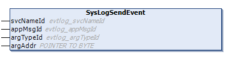

# SysLogSendEvent

## Function Description

This function sends SysLog event when the SysLog service is enabled.

## Library and Namespace

Library name: **SysLog**

Namespace: **SEC\_SYSLOG**

## Graphical Representation



## IL and ST Representation

To see the general representation in IL or ST language, refer to the chapter [*Function and Function Block Representation*](D-SE-0002384.html#D-SE-0002384).

## I/O Variable Description

The following table describes the input variables:

| Input | Datatype | Comment |
| --- | --- | --- |
| svcNameId | [evtlog\_svcNameId](Evtlog_svcNameId-F5F58440.html#Evtlog_svcNameId-F5F58440) | – |
| appMsgId | [evtlog\_scvMsgId](Evtlog_appMsgId-F675BF23.html#Evtlog_appMsgId-F675BF23) | – |
| argTypeId | [evtlog\_argTypeId](Evtlog_argTypeId-F6750F80.html#Evtlog_argTypeId-F6750F80) | – |
| argAddr | POINTER TO BYTE | – |

## Function Coding Example

An example is provided for the SysLogSendEvent function coding in ST language:

```

PROGRAM example
VAR
svcNameId : SEC_SYSLOG.evtlog_svcNameId := SEC_SYSLOG.evtlog_svcNameId.EVTLOG_HTTP;
appMsgID : SEC_SYSLOG.evtlog_appMsgId := SEC_SYSLOG.evtlog_appMsgId.EVTLOG_CONNECTION_SUCCESS;
argTypeId : SEC_SYSLOG.evtlog_argTypeId := SEC_SYSLOG.evtlog_argTypeId.EVTLOG_ARG_STRUCT_LPORT_PEER_USER;
argAddr : POINTER TO BYTE;
arg : SEC_SYSLOG.evtlog_lportPeerUserMsgInfo;
send_event : BOOL := FALSE;
END_VAR

IF send_event THEN
SEC_SYSLOG.syslog_send_event(svcNameId := svcNameId, appMsgId := appMsgId, argTypeID := argTypeId, argAddr := argAddr);
send_event := FALSE;
END_IF
```

EIO0000004614.01