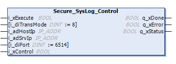

# Secure\_SysLog\_Control

## Function Description

This function is used to manage the Secure SysLog Client library (RFC 5424).

It performs the following actions:

* Defining the server address.
* Defining the server TCP port. The default TCP port is 6514.
* Starting or stopping the service. The service is disabled by default.

NOTE: When the service is initialized, the associated tasks are kept, even when the service is stopped.

## Library and Namespace

Library name: **SysLog**

Namespace: **SEC\_SYSLOG**

## Graphical Representation

## IL and ST Representation

To see the general representation in IL or ST language, refer to the chapter [*Function and Function Block Representation*](D-SE-0002384.html#D-SE-0002384).

## I/O Variable Description

The following table describes the input variables:

| Input | Type | Comment |
| --- | --- | --- |
| i\_xExecute | BOOL | On rising edge, starts the function block execution. |
| i\_diTransMode | DINT | Transport mode of Secure SysLog Control over TCP/TLS. (TCP = 4, TLS = 8) |
| i\_adHostIp | [IP\_ADDR](IP_ADDR-F7171189.html#IP_ADDR-F7171189) | Sets the IP address of the controller. It can be modified when the service is stopped. |
| i\_adSrvIp | [IP\_ADDR](IP_ADDR-F7171189.html#IP_ADDR-F7171189) | Sets the server address. It can be modified when the service is stopped. |
| i\_diPort | DINT | Sets the TCP server port. If 0, the default port (6514) is selected. It can be modified when the service is stopped. |
| i\_xControl | BOOL | Control bit. TRUE indicates that the service is activated. FALSE indicates that the service is stopped. |

The following table describes the output variables:

| Output | Type | Comment |
| --- | --- | --- |
| q\_xDone | BOOL | Set to TRUE when the operation is completed. It is active when i\_xExecute is set to TRUE. |
| q\_xError | BOOL | Set to TRUE when an error occurred. It is active when i\_xExecute is set to TRUE. |
| q\_xStatus | BOOL | Set to TRUE when the service is running. It is active when i\_xExecute is set to TRUE. |

EIO0000004614.01