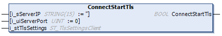

# ConnectStartTls Method

## Overview

|  |  |
| --- | --- |
| Type: | Method |
| Available as of: | V2.2.6.0 |

## Task

Establish a connection to a TCP server using socket with type STARTTLS.

## Functional Description

Establishes a connection to a TCP server using a socket with type STARTTLS. The connection is established without encryption and can be upgraded to a TLS encrypted connection using the method UpgradeToTls().

The BOOL return value is TRUE if the function was executed successfully. Evaluate the property Result, in case the return value is FALSE.

NOTE: The return value of this function indicates only whether the connection could be initiated successfully. The status of the connection must be verified using the property State.

## State Transition of the Client

| Stage | Description |
| --- | --- |
| 1 | Initial state: `Idle` |
| 2 | Function call |
| 3 | State: `Connecting`, otherwise an error is detected. |
| 4 | Final state: `Connected`, otherwise an error is detected.  NOTE: Property TlsUsed indicates FALSE as communication is not encrypted. |

## Interface

| Input | Data type | Valid range | Description |
| --- | --- | --- | --- |
| i\_sServerIP | STRING(15) | - | IP address of the server to connect to. |
| i\_uiServerPort | UINT | 1 ... 65535 | TCP port of the server to connect to. |
| i\_stTlsSettings | ST\_TlsSettingsClient | - | TLS settings for the connection to be established by the FB\_TCPClient2. |

## Used by

* FB\_TCPClient2

EIO0000002803.07