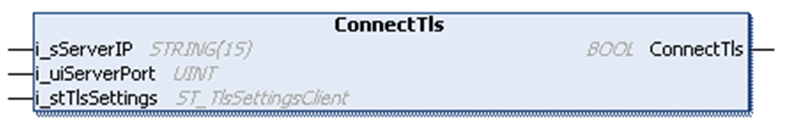

# ConnectTls Method

## Overview

|  |  |
| --- | --- |
| Type: | Method |
| Available as of: | V1.0.4.0 |

## Task

Establish a connection to a TCP server using TLS (Transport Layer Security).

## Functional Description

Establishes a connection to a TCP server using TLS (Transport Layer Security).

Whether a connection using TLS is supported depends on the controller where the FB\_TcpClient2 is used. Refer to the specific manual of your controller to verify if TCP communication using TLS is supported.

The BOOL return value is TRUE if the function was executed successfully. Evaluate the property Result, in case the return value is FALSE.

NOTE: The return value of this function indicates only whether the connection could be initiated successfully. The status of the connection must be verified using the property State.

## State Transition of the Client

| Stage | Description |
| --- | --- |
| 1 | Initial state: `Idle` |
| 2 | Function call |
| 3 | State: `Connecting`, otherwise an error is detected |
| 4 | Final state: `Connected`, otherwise an error is detected |

## Interface

| Input | Data type | Valid range | Description |
| --- | --- | --- | --- |
| i\_sServerIP | STRING(15) | - | IP address of the server to connect to. |
| i\_uiServerPort | UINT | 1 ... 65535 | TCP port of the server to connect to. |
| i\_stTlsSettings | ST\_TlsSettingsClient | - | TLS settings for the connection to be established by the FB\_TCPClient2. |

## Used by

* FB\_TCPClient2

EIO0000002803.07