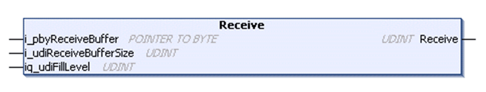

# Receive Method

## Overview

|  |  |
| --- | --- |
| Type: | Method |
| Available as of: | V1.0.4.0 |

## Task

Read data stored in the receive buffer and remove it.

## Functional Description

Reads data stored in the receive buffer and removes it from there if it has been read without detecting an error.

The UDINT return value indicates the number of bytes written to the application-provided buffer.

For additional information about the receive methods, refer to section [Receive Method](D-SE-0080949.html#D-SE-0080949__D-SE-0080949.9).

## Considerations for Connections Using TLS

The behavior of the methods Peek and Receive might be different for the connections with TLS and without TLS. Especially when large data packets are exchanged. When executing the methods on a connection using TLS, it might be required that several method calls must be executed until all data are copied or moved to the application buffer. In every case before processing the data, verify the amount of data which was copied or moved and whether the data are complete.

## Interface

| Input | Data type | Valid range | Description |
| --- | --- | --- | --- |
| i\_pbyReceiveBuffer | POINTER TO BYTE | - | Start address of the buffer to write the received data to. |
| i\_udiReceiveBufferSize | UDINT | 1 ... 2147483647 | Number of bytes to be read.  NOTE: The value must not be greater than the size of the buffer. |

NOTE: To prevent access violation caused by invalid pointer access (out of bounds) to the memory, use the arithmetic operator SIZEOF in conjunction with the targeted buffer to determine the value for i\_udiReceiveBufferSize.

| In\_Out | Data type | Valid range | Description |
| --- | --- | --- | --- |
| iq\_udiFillLevel | UDINT | 1 ... 2147483647 | Fill level of the application-supplied buffer before the operation (data will be written at this offset) and fill level after the received bytes have been written to be buffer. |

## Used by

* FB\_TCPClient/FB\_TCPClient2

## Receive Methods

The methods for receiving of data, provided by the function blocks FB\_TCPClient/FB\_TCPClient2 and FB\_TCPServer/FB\_TCPServer2 in this library provide the input/output parameter iq\_udiFillLevel. This parameter determines the offset in the buffer, and therefore where the data is written. On each execution of the function the value is updated by adding the number of the written bytes to the original value.

In cases where data are received in several packets, but have to be stored in one buffer and are processed later as a whole, the respective receive function can be called several times without modifying the parameter iq\_udiFillLevel from the last function call.

The difference of the receive-buffer size (i\_udiReceiveBufferSize) and the fill level is used to determine the maximum number of bytes to be read.

## Function Call Example

The following graphics illustrate the content of the buffer and the modification of parameter iq\_udiFillLevel for two function calls, whereby the function was executed successfully each time.

| Stage | Description | Illustration |
| --- | --- | --- |
| 1 | Before the first call of the function, the pointer is set to the first index of the buffer. The fill level is set to 0. The parameter i\_udiReceiveBufferSize indicates the absolute size of the buffer in bytes. |  |
| 2 | On each function call, the buffer is erased from the start of the fill level.  During the first function call in this example, the available data was moved from the TCP stack into the buffer. The fill level is updated by the function and indicates the number of read bytes in the buffer.  When the TCP stack has memory space available, the remote client or server is informed about the available space, as a result, it sends the subsequent data packet.  The second function call is executed without any modification of the input parameters. |  |
| 3 | During the second function call, the available data is moved again from the TCP stack into the buffer.  The fill level is updated by the function and then, the value is equal to the value of i\_udiReceiveBufferSize. This means that the receive-buffer is full. A further function call would be aborted with the result FillLevelOutOfRange.  Finally, if the receive-buffer is full, you need to process the data and to update the value of the fill level for the buffer accordingly. |  |

## Data Limits per Function Call

Depending on the controller, the amount of data to be moved in one function call of one of the Receive, Send or Peek methods is limited.

| Controller | Number of bytes which can be moved at once\* |
| --- | --- |
| M241, M251 | 2048 bytes |
| \*This is the maximum value for the difference between buffer size and fill level. | |

For the remaining controllers, the amount of data is limited by the application memory.

EIO0000002803.07