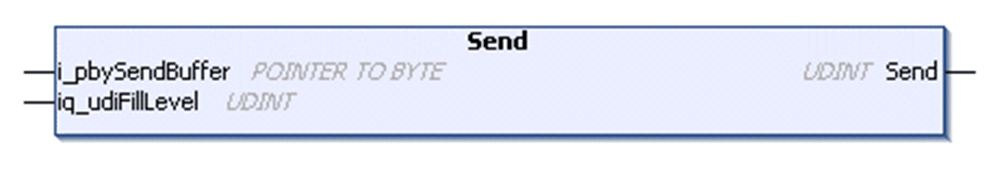

# Send Method

## Overview

|  |  |
| --- | --- |
| Type: | Method |
| Available as of: | V1.0.4.0 |

## Task

Transmits data to the peer.

## Functional Description

Transmits data to the peer. The data is read from a buffer supplied by the application. Returns the number of bytes sent to the remote site as UDINT.

For additional information about the send methods, refer to section [Send Method](D-SE-0080953.html#D-SE-0080953__D-SE-0080953.7).

## Interface

| Input | Data type | Valid range | Description |
| --- | --- | --- | --- |
| i\_pbySendBuffer | POINTER TO BYTE | - | Start address of the buffer that holds the data to be sent. |

| In\_Out | Data type | Valid range | Description |
| --- | --- | --- | --- |
| iq\_udiFillLevel | UDINT | 1 ... 2147483647 | Indicates the fill level of the buffer.  Before function call:  Number of bytes to be sent starting from the start address of the buffer.  After the function call:  Number of bytes in the buffer that could not be sent. |

## Used by

* FB\_TCPClient/FB\_TCPClient2

## Send Methods

The methods for sending of data, provided by the function blocks FB\_TCPClient/FB\_TCPClient2 and FB\_TCPServer/FB\_TCPServer2 in this library provide the input/output parameter iq\_udiFillLevel. This parameter determines the number of bytes in the buffer which are not yet have been sent. On each execution of the function the value is updated by reducing the number of the sent bytes from the original value. In addition, the bytes left in the buffer are copied to the top area of the buffer (data are sent as of start address i\_pbySendBuffer).

If the fill level is 0 after the function call, all data have been sent and the content of the buffer stays unchanged.

In cases where data could not be copied completely into the TCP stack of the controller in one function call, the respective send function can be called several times without modifying the parameter iq\_udiFillLevel from the last function call and without the need of moving data within the buffer.

## Function Call Example

The following graphics illustrate the content of the buffer and the modification of the parameter iq\_udiFillLevel for two function calls, whereby the function was executed successfully each time.

| Stage | Description | Illustration |
| --- | --- | --- |
| 1 | Before the first call of the function, the pointer is set to the first index of the buffer. The fill level is set to the number of bytes to be sent.  In this illustrated example, the buffer of the TCP stack is empty and its size is less than the send buffer of the application. |  |
| 2 | During the first function call, the maximum amount of data (size of the TCP stack) has been copied from the send buffer of the application to the TCP stack.  The data left in the send buffer of the application have been copied by the function to the top area of the buffer. The parameter iq\_udiFillLevel has been updated by the function and indicates the number of bytes which could not be sent.  The second function call is executed without any modification of the parameters.  In the meantime, the TCP stack has sent the data to the remote client or server so that there is space available again in the TCP stack buffer. |  |
| 3 | During the second function call, the data left in the send buffer of the application have been copied to the TCP stack.  The parameter iq\_udiFillLevel has been updated by the function and indicates 0. The content of the send buffer is unchanged.  A further function call would be aborted with the result FillLevelOutOfRange. |  |

Even though the function supports you in sending data in several function calls, you have to take care of a balanced ratio between:

* Send buffer of the application and send buffer of the TCP socket
* Send buffer local and receive buffer of the remote site
* Send interval of the application and processing time of the remote site

To modify the send buffer size, use the corresponding properties of the function block or adjust the default settings through the global variables in the TCPUDP.GVL (refer to [GVL](D-SE-0080937.html#D-SE-0080937)).

## Data Limits per Function Call

Depending on the controller, the amount of data to be copied in one function call of one of the Receive, Send or Peek method is limited.

| Controller | Number of bytes which can be copied at once\* |
| --- | --- |
| M241, M251 | 2048 bytes |
| \*This is the maximum value for the difference between buffer size and fill level. | |

For the remaining controllers, the amount of data is limited by the application memory.

## Special Case - No Data Sent

If the return value of the method indicates 0, no data have been sent and the result of the associated function block is different than Ok. Therefore, verify the result with the use of the method Result of the function block instance after each function call. If the result indicates BufferFull, you must reset the result and try to send the data again during the next program cycle as it is intended for the event if not all data have been sent.

If the result BufferFull still appears, optimize the application parameter:

* Increase the send buffer size of the socket
* Increase the receive buffer size of the socket on the remote site
* Adapt the send cycle to the processing time of the remote site

EIO0000002803.07