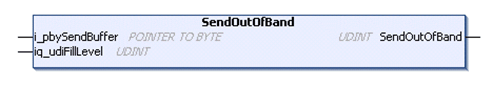

# SendOutOfBand Method

## Overview

|  |  |
| --- | --- |
| Type: | Method |
| Available as of: | V1.0.4.0 |

## Task

Transmit data as OutOfBand data to the peer.

## Functional Description

Transmits data as OutOfBand data to the peer. The data is read from a buffer supplied by the application. Returns the number of bytes sent to the remote site as UDINT.

For additional information about the send methods, refer to section [Send Method](D-SE-0080953.html#D-SE-0080953__D-SE-0080953.7).

## Interface

| Input | Data type | Valid range | Description |
| --- | --- | --- | --- |
| i\_pbySendBuffer | POINTER TO BYTE | - | Start address of the buffer that holds the data to be sent. |

| In\_Out | Data type | Valid range | Description |
| --- | --- | --- | --- |
| iq\_udiFillLevel | UDINT | 1 | Fill level of the application-supplied buffer before the operation. Set this to 1. It will be still 1 after the operation if not all data could be sent. |

## Used by

* FB\_TCPClient

EIO0000002803.07