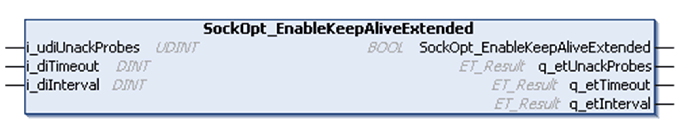

# SockOpt\_EnableKeepAliveExtended Method

## Overview

|  |  |
| --- | --- |
| Type: | Method |
| Available as of: | V1.0.4.0 |

## Task

This method is used to configure the keep alive for the TCP connection to help detect communication interruption.

## Functional Description

This method is used to configure the timeout until the first keep alive packet is sent, the interval between the keep alive packets, and the number of unacknowledged keep alive packets to determine a communication interruption of the TCP connection.

NOTE: This method is not supported on all platforms. Refer to the diagnostic outputs of the method.

## Interface

| Input | Data type | Valid range | Description |
| --- | --- | --- | --- |
| i\_udiUnackProbes | UDINT | - | Specifies the number of unacknowledged probes to send before indicate disconnection. |
| i\_diTimeout | DINT | - | Specifies the timeout in seconds with no activity until the first keep-alive packet is sent. |
| i\_diInterval | DINT | - | Specifies the interval in seconds between unacknowledged keep-alive messages. |

| Output | Data type | Valid range | Description |
| --- | --- | --- | --- |
| q\_etUnackProbes | ET\_Result | - | Indicates the result of i\_udiUnackProbes configuration. |
| q\_etTimeout | ET\_Result | - | Indicates the result of i\_diTimeout configuration. |
| q\_etInterval | ET\_Result | - | Indicates the result of i\_diInterval configuration. |

EIO0000002803.07