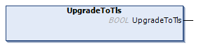

# UpgradeToTls Method

## Overview

|  |  |
| --- | --- |
| Type: | Method |
| Available as of: | V2.2.6.0 |

## Task

Upgrade a connection to a connection with TLS encryption.

## Functional Description

Upgrades a connection to a connection with TLS encryption. The upgrade is exclusive to connections which are established using the method ConnectStartTls().

The BOOL return value is TRUE if the function was executed successfully. Evaluate the property Result, in case the return value is FALSE.

NOTE: The return value of this function indicates only whether the upgrade of the connection could be initiated successfully. The status of the connection must be verified using the State property. In addition you can verify the property TlsUsed which indicates TRUE when the TLS handshake was completed successfully.

## State Transition of the Client

| Stage | Description |
| --- | --- |
| 1 | Initial state: `Connected`.  NOTE: Property TlsUsed indicates FALSE as communication is not encrypted. |
| 2 | Function call |
| 3 | State: `Upgrading`, otherwise an error is detected. |
| 4 | Final state: `Connected`, otherwise an error is detected.  NOTE: Property TlsUsed indicates TRUE as communication is encrypted. |

## Used by

* FB\_TCPClient2

EIO0000002803.07