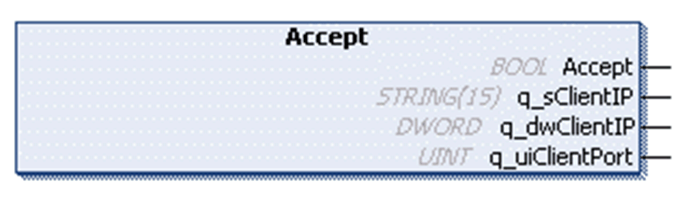

# Accept Method

## Overview

|  |  |
| --- | --- |
| Type: | Method |
| Available as of: | V1.0.4.0 |

## Task

Accept an incoming connection making it available for data transfer.

## Functional Description

Accepts an incoming connection making it available for data transfer. The sources IP address and source port the connection is coming from is available as outputs.

The BOOL return value is TRUE if the function was executed successfully. Evaluate the property Result, in case the return value is FALSE.

## State Transition of the Server

| Stage | Description |
| --- | --- |
| 1 | Initial state: `Idle`, NewConnectionAvailable is TRUE |
| 2 | Functional call |
| 3 | State: `Accepting` |
| 4 | Final state: Listening, otherwise an error is detected |

## Backlog Management

Incoming connections are accepted immediately by the TCP stack and are held in the backlog. For the client, this is a normal connection and it is able to send data to the server. Therefore, it is possible that a connection is accepted which was already closed by the client. The data received from this client are still available and as long as the data were not read out using one of the receive methods, the connection stays registered within the property ConnectedClients. When the data of such a client connection has been read out using a Receive method, this client connection disappears from the list provided with the property ConnectedClients.

The number of connections held by the backlog can be set in the GPL of this library with the parameter Gc\_uiTCPServerMaxBacklog (refer to [Global Variables](D-SE-0080933.html#D-SE-0080933)).

## Interface

| Output | Data type | Valid range | Description |
| --- | --- | --- | --- |
| q\_sClientIP | STRING(15) | - | The IP of the accepted client encoded a string value. |
| q\_dwClientIP | DWORD | - | IP address of the client as DWORD; each byte represents one digit of the IPv4 address. |
| q\_uiClientPort | UINT | 1 ... 65535 | The source port the client is connecting from. |

## Used by

* FB\_TCPServer/FB\_TCPServer2

EIO0000002803.07