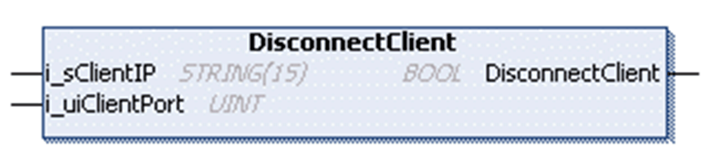

# DisconnectClient Method

## Overview

|  |  |
| --- | --- |
| Type: | Method |
| Available as of: | V1.0.4.0 |

## Task

Disconnect a specific client.

## Functional Description

Disconnects a specific client.

The BOOL return value is TRUE if the function was executed successfully. Evaluate the property Result, in case the return value is FALSE.

## Interface

| Input | Data type | Valid range | Description |
| --- | --- | --- | --- |
| i\_sClientIP | STRING(15) | - | IP address of the client to be disconnected. |
| i\_uiClientPort | UINT | 1 ... 65535 | Source port of the client to be disconnected. |

## Used by

* FB\_TCPServer/FB\_TCPServer2

EIO0000002803.07