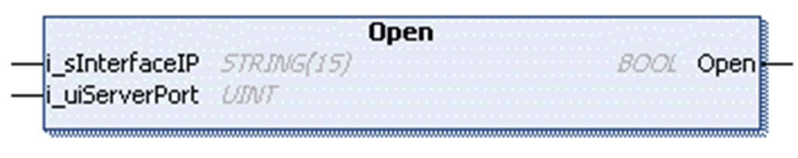

# Open Method

## Overview

|  |  |
| --- | --- |
| Type: | Method |
| Available as of: | V1.0.4.0 |

## Task

Open the server socket.

## Functional Description

Opens the server socket and starts monitoring for incoming connections.

The BOOL return value is TRUE if the function was executed successfully. Evaluate the property Result, in case the return value is FALSE.

## State Transition of the Server

| Stage | Description |
| --- | --- |
| 1 | Initial state: `Idle` |
| 2 | Function call |
| 3 | State: `Opening` |
| 4 | Final state: Listening, otherwise an error is detected |

## Interface

| Input | Data type | Valid range | Description |
| --- | --- | --- | --- |
| i\_sInterfaceIP | STRING(15) | - | IP address of the interface to bind to. If null or 0.0.0.0, the server is available on all interfaces. |
| i\_uiServerPort | UINT | 1 ... 65535 | TCP port to monitor on. |

## Used by

* FB\_TCPServer/FB\_TCPServer2

EIO0000002803.07