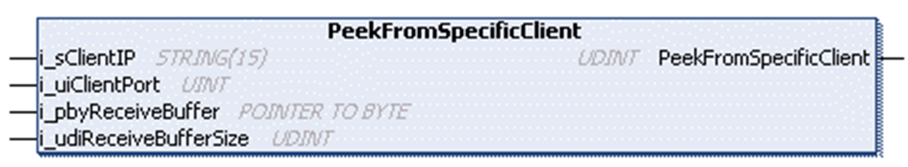

# PeekFromSpecificClient Method

## Overview

|  |  |
| --- | --- |
| Type: | Method |
| Available as of: | V1.0.4.0 |

## Task

Read data stored in the receive buffer of the client specified by its source IP and port.

## Functional Description

Reads data stored in the receive buffer of the client specified by its source IP and port without removing it from there after it has been read.

The Peek method can be used if a certain amount of data needs to be available to be processed correctly and the amount can be determined from parts of the data (a length field for example). In that case, the data can be copied to the application in one call of the `Receive` method.

The UDINT return value indicates the number of bytes written to the application-provided buffer.

## Considerations for Connections Using TLS

The behavior of the methods Peek and Receive might be different for the connections with TLS and without TLS. Especially when large data packets are exchanged. When executing the methods on a connection using TLS, it might be required that several method calls must be executed until all data are copied or moved to the application buffer. In every case before processing the data, verify the amount of data which was copied or moved and whether the data are complete.

## Interface

| Input | Data type | Valid range | Description |
| --- | --- | --- | --- |
| i\_sClientIP | STRING(15) | - | IP address of the connected client the data is to be read from. |
| i\_uiClientPort | UINT | 1 ... 65535 | Source port of the connected client the data is to be read from. |
| i\_pbyReceiveBuffer | POINTER TO BYTE | - | Start address of the buffer to write the received data to. |
| i\_udiReceiveBufferSize | UDINT | 1 ... 2147483647 | Number of bytes to be read.  NOTE: The value must not be greater than the size of the buffer. |

## Used by

* FB\_TCPServer/FB\_TCPServer2

EIO0000002803.07