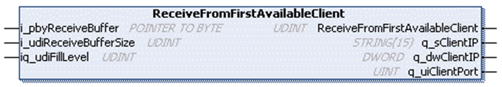

# ReceiveFromFirstAvailableClient Method

## Overview

|  |  |
| --- | --- |
| Type: | Method |
| Available as of: | V1.0.4.0 |

## Task

Read data stored in the receive buffer of the first client that has data available to be read and remove it from there if it has been read without detecting an error.

## Functional Description

Reads data stored in the receive buffer of the first client that has data available to be read and removes it from there if it has been read without detecting an error.

The UDINT return value indicates the number of bytes written to the application-provided buffer.

For additional information about the receive methods, refer to section [Receive Method](D-SE-0080949.html#D-SE-0080949__D-SE-0080949.9).

## Considerations for Connections Using TLS

The behavior of the methods Peek and Receive might be different for the connections with TLS and without TLS. Especially when large data packets are exchanged. When executing the methods on a connection using TLS, it might be required that several method calls must be executed until all data are copied or moved to the application buffer. In every case before processing the data, verify the amount of data which was copied or moved and whether the data are complete.

## Interface

| Input | Data type | Valid range | Description |
| --- | --- | --- | --- |
| i\_pbyReceiveBuffer | POINTER TO BYTE | - | Start address of the buffer to write the received data to. |
| i\_udiReceiveBufferSize | UDINT | 1 ... 2147483647 | Number of bytes to be read.  NOTE: The value must not be greater than the size of the buffer. |

NOTE: To prevent access violation caused by invalid pointer access (out of bounds) to the memory, use the arithmetic operator SIZEOF in conjunction with the targeted buffer to determine the value for i\_udiReceiveBufferSize.

| In\_Out | Data type | Valid range | Description |
| --- | --- | --- | --- |
| iq\_udiFillLevel | UDINT | 1 ... 2147483647 | Indicates the fill level of the buffer.  Before function call:  Data will be written starting at this offset.  After the function call:  Updated by adding the number of written bytes to the original value. |

| Output | Data type | Valid range | Description |
| --- | --- | --- | --- |
| q\_sClientIP | STRING(15) | - | IP address of the client. |
| q\_dwClientIP | DWORD | - | IP address of the client as DWORD; each byte represents one digit of the IPv4 address. |
| q\_uiClientPort | UINT | - | Source port of the client. |

## Used by

* FB\_TCPServer/FB\_TCPServer2

EIO0000002803.07