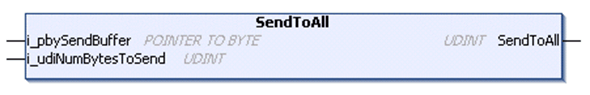

# SendToAll Method

## Overview

|  |  |
| --- | --- |
| Type: | Method |
| Available as of: | V1.0.4.0 |

## Task

Send data to the connected clients.

## Functional Description

Sends data to the connected clients. Errors detected for single clients are ignored. Returns the sum of the sent bytes as UDINT. If this value is equal to the number of connected clients multiplied with the amount of data to be sent, the data was transmitted successfully to the clients.

NOTE: If you need to determine if any individual client had detected an error, then use the SendToSpecificClient method. You can retrieve the array of connected clients using the ConnectedClients property, and transmit the message to the connected clients individually.

## Interface

| Input | Data type | Valid range | Description |
| --- | --- | --- | --- |
| i\_pbySendBuffer | POINTER TO BYTE | - | Start address of the buffer that holds the data to be sent. |
| i\_udiNumBytesToSend | UDINT | 1 ... 2147483647 | Number of bytes in the buffer to be sent. |

## Used by

* FB\_TCPServer/FB\_TCPServer2

EIO0000002803.07