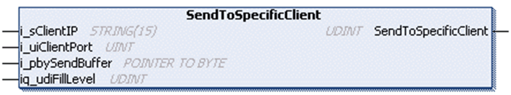

# SendToSpecificClient Method

## Overview

|  |  |
| --- | --- |
| Type: | Method |
| Available as of: | V1.0.4.0 |

## Task

Sends data only to a specific client, identified by its IP and port.

## Functional Description

Sends data only to a specific client, identified by its IP and port. Returns the number of bytes sent to the remote site as UDINT.

For additional information about the send methods, refer to section [Send Method](D-SE-0080953.html#D-SE-0080953__D-SE-0080953.7).

## Interface

| Input | Data type | Valid range | Description |
| --- | --- | --- | --- |
| i\_sClientIP | STRING(15) | - | IP address of the connected client the data is to be sent to. |
| i\_uiClientPort | UINT | 1 ... 65535 | Source port of the connected client the data is to be sent to. |
| i\_pbySendBuffer | POINTER TO BYTE | - | Start address of the buffer that holds the data to be sent. |

| In\_Out | Data type | Valid range | Description |
| --- | --- | --- | --- |
| iq\_udiFillLevel | UDINT | 1 ... 2147483647 | Indicates the fill level of the buffer.  Before function call:  Number of bytes to be sent starting from the start address of the buffer.  After the function call:  Number of bytes in the buffer that could not be sent. |

## Used by

* FB\_TCPServer/FB\_TCPServer2

EIO0000002803.07