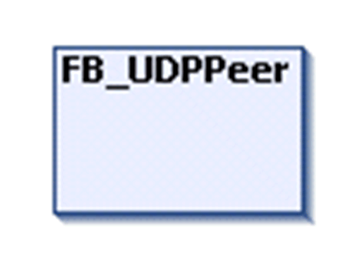

# FB\_UDPPeer

## Overview

|  |  |
| --- | --- |
| Type: | Function block |
| Available as of: | V1.0.4.0 |
| Inherits from: | - |
| Implements: | - |



## Task

Represents an endpoint for sending and receiving messages using the message-based UDP protocol.

## Functional Description

The usual order of command is to call the Open method first. If this was successful, messages can be sent. If you intend to monitor on a specific port, the method Bind must be used to bind the socket to this port and optionally to a specific Ethernet interface. If messages are to be received on all available Ethernet interfaces and the outgoing interface are to be used automatically; use a null string or 0.0.0.0 as the interface-input of the method.

To send data to other peers, use the Send method. On the first send from an unbound socket, it is automatically bound and the Receive method can be used afterwards. If the runtime supports it, the IP and port the socket got bound to can be requested using the BoundIPAddress and BoundPort properties.

To verify whether there is data ready to be read, the properties IsReadable and BytesAvailableToRead can be used.

For both the Send and Receive methods, a buffer has to be provided by the application that is filled by the Received method and contains the data to be sent for the Send method.

Broadcasts can be sent and received without preparation. A multicast group needs to be joined in order to receive multicast messages. Therefore, the methods JoinMulticastGroup and LeaveMulticastGroup are provided.

If you intend to send UDP-multicast packages using the FB\_UDPPeer function block, set the value of the property SockOpt\_MulticastDefaultInterface to the IP address of the interface from which the packages should be sent. This has to be performed after calling the Open method and before the first call of the SendTo method.

NOTE: Specifying the default interface for multicast packages by the value of the property SockOpt\_MulticastDefaultInterface helps to avoid that the packages are sent to all available network.

The Close method can be used to stop further data transfer and close the socket.

If processing in a method is unsuccessful, it is indicated in the value of the Result property. The value of Result must be verified after every method call. The result can be reset to Ok using the ResetResult method.

NOTE: All methods are blocked as long as the value of the property Result is unequal to Ok. A method call in this case is aborted without affecting the information of the Result property.

## Interface

The function block does not have inputs and outputs. The functionality is available via methods and properties. You do not need to call the function block directly in your application.

## Implementation Examples

The following application examples indicate how to join a multicast group and how to send a message to it:

`Peer1`:

```
PROGRAM Peer1
VAR
    //Commands
    xOpen : BOOL ;
    xSend : BOOL ;
    xClose : BOOL ;
    //UDP peer1 instance
    fbUdpPeer1 : TCPUDP.FB_UDPPeer ;
    //Peer1 state
    etResult : TCPUDP.ET_State ;
    etState : TCPUDP.ET_Result ;
    //Application parameters
    iState : INT ;
    sSendMessage : STRING ;
    //Connection parameters peer1
    sIpAddressLocal : STRING := '120.120.120.13' ; //IP
    //Multicast group parameters
    sMulticastIP : STRING := '224.0.1.38' ; //Unassigned multicast IP
    uiPortPeer2 : UINT := 8002 ; //Port of peer2 joined to multicast group
END_VAR
```

```
CASE iState OF
    0 : //idle
        IF xOpen THEN
            fbUdpPeer1.Open ( ) ;
            IF fbUdpPeer1.State = TcpUdp.ET_State.Opened THEN
                //opened
                fbUdpPeer1.SockOpt_MulticastDefaultInterface := sIpAddressLocal ; //IP address of the interface from which the packages should be sent
                iState := 20 ;
            ELSE
                iState := 100 ; //error detected
            END_IF
        END_IF
    20 : //opened
        IF xSend THEN //Send from peer1 to multicast group
            sSendMessage := 'Hello world!' ;
            fbUdpPeer1.SendTo ( i_pbySendBuffer := ADR (sSendMessage ) ,
            i_udiNumBytesToSend := INT_TO_UDINT ( LEN ( sSendMessage ) ) ,
            i_sPeerIP := sMulticastIP ,
            i_uiPeerPort := uiPortPeer2 ) ;
        IF fbUdpPeer1.Result <> TcpUdp.ET_Result.Ok THEN
            iState := 100 ; //error detected
        END_IF
    ELSIF xClose THEN
        fbUdpPeer1.Close ( ) ;
        IF fbUdpPeer1.State = TcpUdp.ET_State.Idle THEN
            iState := 0 ; //closed = idle
        ELSE
            iState := 100 ; //error detected
        END_IF
        END_IF
    100 : //error state
        (*your code comes here*)
END_CASE
//check cyclically state
etResult := fbUdpPeer1.State ;
etState := fbUdpPeer1.Result ;
//reset commands
xOpen := xSend := xClose := FALSE ;
```

`Peer2`:

```
PROGRAM Peer2
VAR
    //Commands
    xOpenAndBind : BOOL ;
    xJoinMulticastGroup : BOOL ;
    xReceive : BOOL ;
    xClose : BOOL ;
    //UDP Peer2 instance
    fbUdpPeer2 : TCPUDP.FB_UDPPeer ;
    //Peer2 state
    etResult : TCPUDP.ET_State ;
    etState : TCPUDP.ET_Result ;
    //Application parameters
    iState : INT ;
    sReceiveMessage : STRING ;
    //Connection parameters Peer2
    sIpAddressLocal : STRING ;= '120.120.120.13' ; //IP
    uiPortLocal : UINT := 8002 ; //Port
    //Multicast group parameters
    sMulticastIP : STRING ;= '224.0.1.38' ; //Unassigned multicast IP
END_VAR
```

```
CASE iState OF
    0 : //idle
        IF xOpenAndBind THEN
            //open
            fbUdpPeer2.Open ( ) ;
            IF fbUdpPeer2.State = TcpUdp.ET_State.Opened THEN
                fbUdpPeer2.Bind ( i_sLocalIP := '' , i_uiLocalPort := uiPortLocal ) ; //opened... now bind
                IF fbUdpPeer2.State = TcpUdp.ET_State.Bound THEN
                    iState := 20 ; //bound
                END_IF
            END_IF
            IF fbUdpPeer2.Result <> TcpUdp.ET_Result.Ok THEN
                iState := 100 ; //error detected
            END_IF
        END_IF
    20 : //bound
        IF xJoinMulticastGroup THEN
            fbUdpPeer2.JoinMulticastGroup ( i_sInterfaceIP := sIpAddressLocal , i_sGroupIP := sMulticastIP ) ;
                IF fbUdpPeer2.Result <> TcpUdp.ET_Result.Ok THEN
                    iState := 100 ; //error detected
                END_IF
            ELSIF xReceive THEN
                //Receive message
                fbUdpPeer2.ReceiveFrom ( i_pbyReceiveBuffer := ADR ( sReceiveMessage ) ,
                        i_udiReceiveBufferSize := SIZEOF ( sReceiveMessage ) ) ;
                IF fbUdpPeer2.Result <> TcpUdp.ET_Result.Ok THEN
                    iState := 100 ; //error detected
                END_IF
            ELSIF xClose THEN
                fbUdpPeer2.Close ( ) ;
                IF fbUdpPeer2.State = TcpUdp.ET_State.Idle THEN
                    iState := 0 ; //closed = idle
                ELSE
                    iState := 100 ; //error detected
                END_IF

            END_IF

        100 : //error state
            (*your code comes here*)
END_CASE
//check cyclically state
etResult := fbUdpPeer2.State ;
etState := fbUdpPeer2.Result ;
//reset commands
xOpenAndBind := xJoinMulticastGroup := xReceive := xClose := FALSE ;
```

EIO0000002803.07