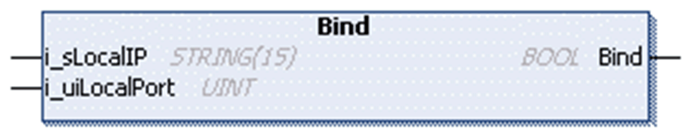

# FB\_UDPPeer - Method Bind

## Overview

|  |  |
| --- | --- |
| Type: | Method |
| Available as of: | V1.0.4.0 |

## Task

Configure the opened UDP peers for a specified local IP address and port.

## Functional Description

Configures the opened UDP peer for a specified local IP address and port as source for messages to be sent and received on.

NOTE: If you intend to receive multicast or broadcast messages you must leave the input i\_sLocalIp unconnected or connected to a null string.

The BOOL return value is TRUE if the function was executed successfully. Evaluate the property Result, in case the return value is FALSE.

NOTE: The socket is bound automatically to an available port when data are sent from an unbound socket.

## State Transition of the Peer

| Stage | Description |
| --- | --- |
| 1 | Initial state: `Opened` |
| 2 | Function call |
| 3 | State: `Bound` |

## Interface

| Input | Data type | Valid range | Description |
| --- | --- | --- | --- |
| i\_sLocalIP | STRING(15) | - | IP address of the interface to bind on. If null or 0.0.0.0, the peer monitors all interfaces. |
| i\_uiLocalPort | UINT | 1 ... 65535 | UDP port to bind on. |

EIO0000002803.07