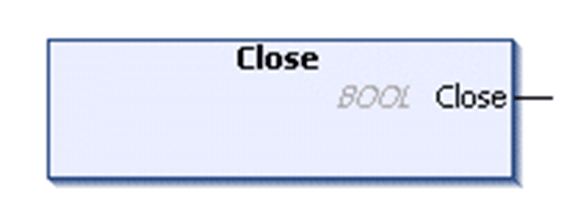

# FB\_UDPPeer - Method Close

## Overview

|  |  |
| --- | --- |
| Type: | Method |
| Available as of: | V1.0.4.0 |

## Task

Close the socket.

## Functional Description

Closes the socket, possibly discarding data in the receive buffer. The multicast-groups joined are automatically left.

The BOOL return value is TRUE if the function was executed successfully. Evaluate the property Result, in case the return value is FALSE.

## State Transition of the Peer

| Stage | Description |
| --- | --- |
| 1 | Initial state: `Opened` or `Bound` |
| 2 | Function call |
| 3 | State: `Idle` |

EIO0000002803.07