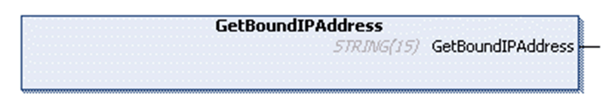

# FB\_UDPPeer - Method GetBoundIPAddress

## Overview

|  |  |
| --- | --- |
| Type: | Method |
| Available as of: | V1.0.4.0 |

## Task

Return the bound IP address.

## Functional Description

This function is used to obtain the IP address the socket is bound to. If the return value is a null string (`''`), the IP address could not be obtained.

This function is supported on platforms where SysSocket library version 3.5.6.0 or later is installed.

EIO0000002803.07