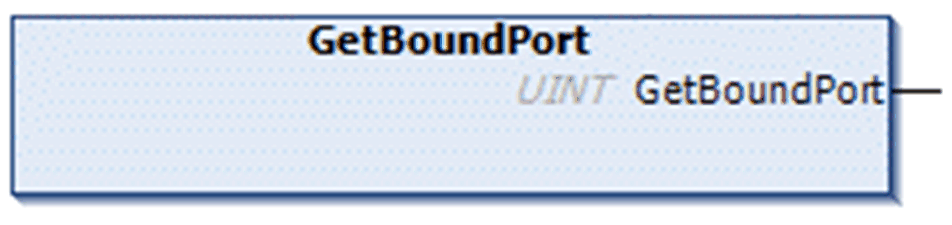

# FB\_UDPPeer - Method GetBoundPort

## Overview

|  |  |
| --- | --- |
| Type: | Method |
| Available as of: | V1.0.4.0 |

## Task

Return the bound port.

## Functional Description

This function is used to obtain the port the socket is bound to. If the UINT return value is 0, the port number could not be obtained.

This function is supported on platforms where SysSocket library version 3.5.6.0 or later is installed.

EIO0000002803.07