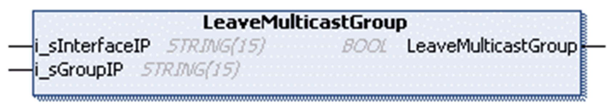

# FB\_UDPPeer - Method LeaveMulticastGroup

## Overview

|  |  |
| --- | --- |
| Type: | Method |
| Available as of: | V1.0.4.0 |

## Task

Leave a multicast group.

## Functional Description

Leaves a multicast group by sending an IGMP DropMembership message. After the multicast group has been left, messages sent to that group address will not be received anymore.

The BOOL return value is TRUE if the function was executed successfully. Evaluate the property Result, in case the return value is FALSE.

## Interface

| Input | Data type | Valid range | Description |
| --- | --- | --- | --- |
| i\_sInterfaceIP | STRING(15) | - | IP address of the interface to leave the multicast group on. |
| i\_sGroupIP | STRING(15) | - | Multicast address of the group to leave. |

EIO0000002803.07