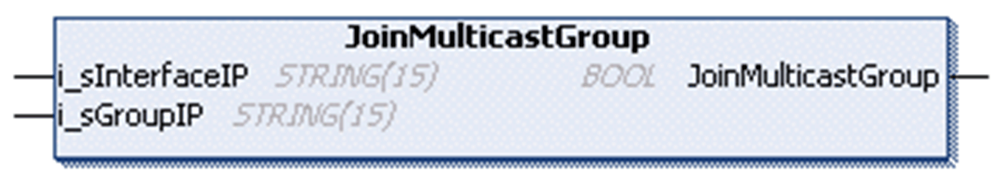

# FB\_UDPPeer - Method JoinMulticastGroup

## Overview

|  |  |
| --- | --- |
| Type: | Method |
| Available as of: | V1.0.4.0 |

## Task

Join a multicast group for receiving messages.

## Functional Description

Joins a multicast group for receiving messages sent to that group address by sending an IGMP AddMembership message (Internet Group Management Protocol).

The BOOL return value is TRUE if the function was executed successfully. Evaluate the property Result, in case the return value is FALSE.

NOTE: In order to receive multicast messages, the Bind [method](D-SE-0080984.html#D-SE-0080984) must first be used with a null string for the input i\_sLocalIp, or leave the input unconnected.

Also refer to the [implementation examples](D-SE-0080982.html#D-SE-0080982__D-SE-0080982.8).

## Interface

| Input | Data type | Valid range | Description |
| --- | --- | --- | --- |
| i\_sInterfaceIP | STRING(15) | - | IP address of the interface to join the multicast group on. |
| i\_sGroupIP | STRING(15) | - | Multicast address of the group to be joined. |

EIO0000002803.07