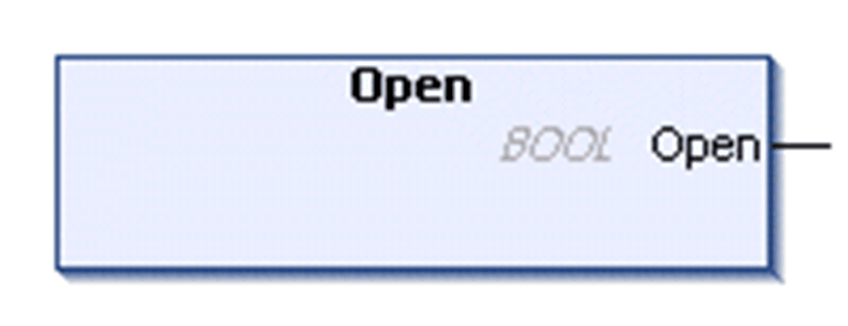

# FB\_UDPPeer - Method Open

## Overview

|  |  |
| --- | --- |
| Type: | Method |
| Available as of: | V1.0.4.0 |

## Task

Initialize and open the UDP peers.

## Functional Description

Initializes and opens the UDP peer.

The BOOL return value is TRUE if the function was executed successfully. Evaluate the property Result, in case the return value is FALSE.

NOTE: If you intend to monitor on a specific port, the method Bind must be used subsequently to the method Open to bind the open socket.

## State Transition of the Peer

| Stage | Description |
| --- | --- |
| 1 | Initial state: `Idle` |
| 2 | Function call |
| 3 | State: `Opened` |

EIO0000002803.07