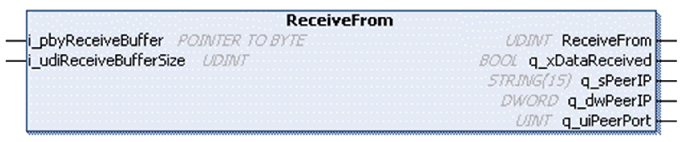

# FB\_UDPPeer - Method ReceiveFrom

## Overview

|  |  |
| --- | --- |
| Type: | Method |
| Available as of: | V1.0.4.0 |

## Task

Read data stored in the receive buffer.

## Functional Description

Reads data stored in the receive buffer and removes it from the buffer if it has been read without detecting an error. At most one message is read no matter how much data is available to be read and how large is the application-provided buffer.

The UDINT return value indicates the number of bytes written to the application-provided buffer.

## Interface

| Input | Data type | Valid range | Description |
| --- | --- | --- | --- |
| i\_pbyReceiveBuffer | POINTER TO BYTE | - | Start address of the buffer to write the received data to. |
| i\_udiReceiveBufferSize | UDINT | 1 ... 2147483647 | Number of bytes to be read.  NOTE: The value must not be greater than the size of the buffer. |

| Output | Data type | Valid range | Description |
| --- | --- | --- | --- |
| q\_xDataReceived | BOOL | - | Indicates whether a message was received. |
| q\_sPeerIP | STRING(15) | - | Source IP of the peer from whom the message was received in STRING representation. |
| q\_dwPeerIP | DWORD | - | IP address of the peer (sender) as DWORD; each byte represents one digit of the IPv4 address. |
| q\_uiPeerPort | UINT | - | Source port the message was received from. |

## Data Limits per Function Call

Depending on the controller, the amount of data to be moved in one function call of one of the Receive, Send or Peek methods is limited.

| Controller | Number of bytes which can be moved at once |
| --- | --- |
| M241, M251 | 2048 bytes |

For the remaining controllers, the amount of data is limited by the application memory.

EIO0000002803.07