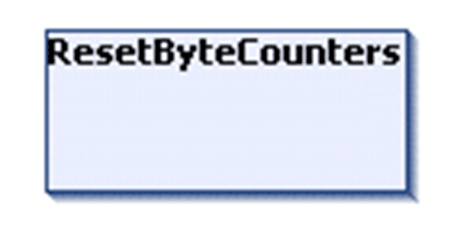

# FB\_UDPPeer - Method ResetByteCounters

## Overview

|  |  |
| --- | --- |
| Type: | Method |
| Available as of: | V1.0.4.0 |

## Task

Reset the counters of total received and sent bytes to 0.

## Functional Description

Resets the counters of total received and sent bytes to 0. No return value.

EIO0000002803.07