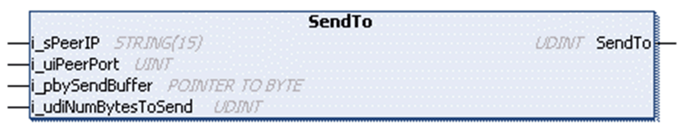

# FB\_UDPPeer - Method SendTo

## Overview

|  |  |
| --- | --- |
| Type: | Method |
| Available as of: | V1.0.4.0 |

## Task

Transmit one message.

## Functional Description

Transmits one message. The data is read from a buffer supplied by the application. This method is used for sending unicast, multicast, or broadcast messages. If the socket was not bound before, it is automatically bound to an available port. Returns the number of bytes sent as UDINT.

## Interface

| Input | Data type | Valid range | Description |
| --- | --- | --- | --- |
| i\_sPeerIP | STRING(15) | - | Destination address to send the message to. |
| i\_uiPeerPort | UINT | - | Destination port to send the message to. |
| i\_pbySendBuffer | POINTER TO BYTE | - | Start address of the buffer that holds the data to be sent. |
| i\_udiNumBytesToSend | UDINT | 1 ... 2147483647 | Number of bytes in the application-provided buffer that is to be sent. |

## Data Limits per Function Call

Depending on the controller, the amount of data to be moved in one function call of one of the Receive, Send or Peek methods is limited.

| Controller | Number of bytes which can be moved at once |
| --- | --- |
| M241, M251 | 2048 bytes |

For the remaining controllers, the amount of data is limited by the application memory.

EIO0000002803.07