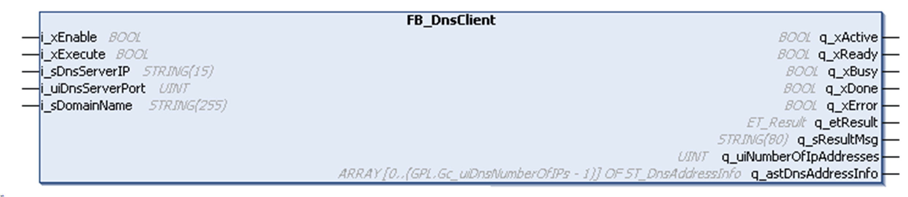

# FB\_DnsClient

## Overview

|  |  |
| --- | --- |
| Type: | Function block |
| Available as of: | V1.1.0.0 |

## Task

Communicates with the specified DNS server to request the resolution of a domain name into an IPv4 address.

## Functional Description

This function block is used to communicate with a DNS server (according to RFC1035) in order to get the registered IPv4 address corresponding to the specified domain name. Therefore, an UDP socket is open and a DNS request is sent to the server, which is specified by the inputs i\_sDnsServerIp and i\_uiDnsServerPort. When a response from the server has been received or the timeout is reached, the socket is closed again.

NOTE: The function block supports authoritative and recursive answers provided by the DNS server.

If the domain name could be resolved by the server and the response has been received correctly, the resolved IPv4 addresses and corresponding time to live (TTL) are available on the output q\_astDnsAddressInfo. To limit the network traffic, the TTL value can be used to cache the resolved addresses.

NOTE: Refresh the IP-Cache according to the information provided by TTL.

The communication with the DNS server takes several program cycles. The status of the function block is indicated by the outputs q\_xBusy, q\_xError, and q\_xDone.

As long as the function block is executed, the output q\_xBusy is set to TRUE. The output q\_xDone is set to TRUE after the function block has been executed successfully.

Status messages and diagnostic information are provided using the outputs q\_xError (TRUE if an error has been detected), q\_etResult, and q\_etResultMsg.

To acknowledge detected errors, disable and re-enable the function block to be able to execute a new attempt to resolve the domain name.

## Interface

| Input | Data type | Description |
| --- | --- | --- |
| i\_xEnable | BOOL | Activation and initialization of the function block. |
| i\_xExecute | BOOL | Upon a rising edge of this input the DNS request is sent to the DNS server. |
| i\_sDnsServerIP | STRING(15) | Specifies the IP address of the external DNS server. |
| i\_uiDnsServerPort | UINT | Specifies the port of the external DNS server.  If the pin is not assigned the default value 53 is used. |
| i\_sDomainName | STRING(255) | Domain name to be resolved.(Only ASCII symbols are supported) |

| Output | Data type | Description |
| --- | --- | --- |
| q\_xActive | BOOL | If the function block is active, this output is set to TRUE. |
| q\_xReady | BOOL | Indicates TRUE if the function block is ready to receive an execute command. |
| q\_xBusy | BOOL | If this output is set to TRUE, the function block execution is in progress. |
| q\_xDone | BOOL | If this output is set to TRUE, the execution has been completed successfully. |
| q\_xError | BOOL | If this output is set to TRUE, an error has been detected. For details, refer to q\_etResult and q\_etResultMsg. |
| q\_etResult | ET\_Result | Provides diagnostic and status information as a numeric value. |
| q\_sResultMsg | STRING(80) | Provides additional diagnostic and status information as a text message. |
| q\_uiNumberOfIpAddresses | UINT | Number of IP addresses the DNS server returned. |
| q\_astDnsAddressInfo | ARRAY [0..GPL.Gc\_uiDnsNumberOfIPs-1] OF ST\_DnsAddressInfo | Structure contains information about the resolved domain name received from the DNS server. |

EIO0000002803.07