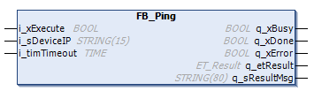

# FB\_Ping

## Overview

|  |  |
| --- | --- |
| Type: | Function block |
| Available as of: | V2.2.6.0 |

## Task

Send an ICMP (Internet Control Message Protocol) echo request to test the availability of a remote device.

## Functional Description

This function block is used to send an ICMP echo request to a specified IP address to test the availability of a remote device.

NOTE: The function block uses an asynchronous task for the time it is waiting for the response. Therefore, the function block automatically initializes the asynchronous manager if not yet done inside the application.

## Interface

| Input | Data type | Description |
| --- | --- | --- |
| i\_xExecute | BOOL | Upon a rising edge of this input the ICMP echo request is sent to the IP address. |
| i\_sDeviceIP | STRING(15) | Specifies the IP address of the remote device. |
| i\_timTimeout | TIME | Timeout for waiting for a reply.  Default value: T#4s |

| Output | Data type | Description |
| --- | --- | --- |
| q\_xBusy | BOOL | If this output is set to TRUE, the function block execution is in progress. |
| q\_xDone | BOOL | If this output is set to TRUE, the execution has been completed successfully. |
| q\_xError | BOOL | If this output is set to TRUE, an error has been detected. For details, refer to q\_etResult and q\_etResultMsg. |
| q\_etResult | ET\_Result | Provides diagnostic and status information as a numeric value. |
| q\_sResultMsg | STRING(80) | Provides additional diagnostic and status information as a text message. |

EIO0000002803.07